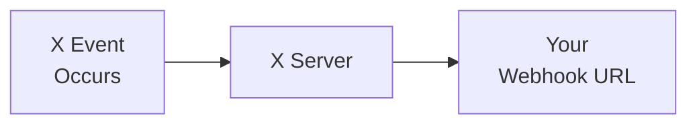

import { Button } from '/snippets/button.mdx';

The V2 Webhooks API enables developers to receive real-time event notifications from X accounts via webhook-based JSON messages. These APIs allow you to register and manage webhooks, develop consumer applications to process events, and ensure secure communication through challenge-response checks (CRC) and signature headers.

## Overview

<CardGroup cols={2}>
  <Card title="Real-time delivery" icon="bolt">
    Receive events instantly as they occur
  </Card>
  <Card title="Push-based" icon="/icons/xds/icon-arrow-right.svg">
    Data sent directly to your server — no polling
  </Card>
  <Card title="Secure" icon="/icons/xds/icon-shield-keyhole.svg">
    CRC validation and signature verification
  </Card>
  <Card title="Reliable" icon="gauge">
    Retry and recovery support
  </Card>
</CardGroup>

---

## Products that support webhooks

These are the products that currently support delivering events via webhook:

| Product | Description |
|:--------|:------------|
| [X Activity API (XAA)](/x-api/activity/introduction) | Receive real-time events for activity happening on X |
| [Account Activity API (AAA)](/x-api/account-activity/introduction) | Receive real-time events tied to specific user accounts |
| [Filtered Stream Webhooks](/x-api/webhooks/stream/introduction) | Receive filtered stream Posts via webhook delivery |

---

## How webhooks work

```mermaid actions={false}
flowchart LR
    A["X Event<br/>Occurs"] --> B["X Server"] --> C["Your<br/>Webhook URL"]
```

1. **Event occurs** — A user posts, sends a DM, gets followed, etc.
2. **X sends a POST request** — JSON event payload sent to your registered webhook URL
3. **You process the event** — Your server handles the event data
4. **Respond with 200 OK** — Return a 200 status to acknowledge receipt

---

## Webhook requirements

| Requirement | Description |
|:------------|:------------|
| **HTTPS** | Webhook URL must use HTTPS |
| **Publicly accessible** | URL must be reachable from the internet |
| **No port specification** | The URL cannot include a port (e.g., `https://mydomain.com:5000/webhook` will not work) |
| **Fast response** | Respond within 10 seconds |
| **200 OK** | Return 200 status to acknowledge receipt |
| **CRC support** | Must respond to Challenge-Response Check GET requests ([learn more](/x-api/webhooks/quickstart#2-the-crc-check)) |

---

## Endpoints

| Method | Endpoint | Description |
|:-------|:---------|:------------|
| POST | [`/2/webhooks`](/x-api/webhooks/create-webhook) | Register a new webhook |
| GET | [`/2/webhooks`](/x-api/webhooks/get-webhook) | List registered webhooks |
| DELETE | [`/2/webhooks/:webhook_id`](/x-api/webhooks/delete-webhook) | Delete a webhook |
| POST | [`/2/webhooks/replay`](/x-api/webhooks/create-replay-job-for-webhook) | Create a replay job for webhook |
| PUT | [`/2/webhooks/:webhook_id`](/x-api/webhooks/validate-webhook) | Trigger CRC check and re-enable a webhook |

All endpoints require **OAuth2 App Only Bearer Token** authentication.

---

## Security

X's webhook-based APIs provide two methods for confirming the security of your webhook server:

1. **Challenge-Response Check (CRC)** — X sends periodic GET requests to your webhook URL. You respond with an HMAC-SHA256 hash to prove you control the endpoint. CRC checks happen on initial registration, hourly, and on manual re-validation.

2. **Signature verification** — Each POST request from X includes a signature header. You can verify this signature to confirm X is the source of incoming events.

### Signature headers

X sends one of two signature headers on each webhook POST. Both use the format `sha256=<base64_encoded_hmac_sha256>` and are calculated over the raw request body.

| Header | Secret used | Recommendation |
|:-------|:------------|:---------------|
| `X-Twitter-Webhooks-Signature-OAuth2` | OAuth 2.0 client secret | Recommended. Verify this header when present. |
| `X-Twitter-Webhooks-Signature` | OAuth 1.0 consumer secret (API Secret Key) | Legacy. Format unchanged. Supported for backward compatibility. |

- Apps that only have an OAuth 2.0 client secret configured receive only `X-Twitter-Webhooks-Signature-OAuth2`.
- Apps that have both an OAuth 2.0 client secret and an OAuth 1.0 consumer secret may receive both headers during migration. Verify `X-Twitter-Webhooks-Signature-OAuth2` and, if you still need to support the legacy path, fall back to `X-Twitter-Webhooks-Signature`.
- Apps that only have an OAuth 1.0 consumer secret continue to receive `X-Twitter-Webhooks-Signature` unchanged.

The same rules apply to the CRC `response_token`: generate it with the OAuth 2.0 client secret when available, or with the OAuth 1.0 consumer secret for existing OAuth 1.0-only integrations.

<Note>
The OAuth 2.0 App Only Bearer Token used in the `Authorization` header when calling `/2/webhooks` is **not** used to compute CRC responses or webhook signatures. CRC and signature verification always use the app's OAuth 2.0 client secret or OAuth 1.0 consumer secret. Keep client and consumer secrets server-side, and never include them in webhook registration requests.
</Note>

<Card title="See full implementation details" icon="/icons/xds/icon-code.svg" href="/x-api/webhooks/quickstart">
  Step-by-step CRC setup, code examples, and signature verification
</Card>

---

## Webhook validation

A CRC check is sent to your webhook in the following cases:

- Immediately upon creation
- On an explicit PUT request (`PUT /2/webhooks/{id}`)
- Periodically every 30 minutes, but only if the webhook has not been successfully validated in the past 24 hours

A webhook is marked as **invalid** when:

- It returns an invalid response to a CRC check
  - Returns a 2XX status code but the `response_token` is incorrect
  - Returns a 3XX status code
  - Results in an SSL exception
- It experiences persistent transient errors such that it has not successfully validated for more than 28 hours (includes a 4-hour grace period for transient issues)
  - The following responses are treated as transient errors:
    - 4XX status code
    - 5XX status code
    - Request timeout
    - Channel closed

You can check the valid/invalid status of a webhook using the `GET /2/webhooks` endpoint or via the toolbox in the Developer Console.

---

## Getting started

<Note>
**Prerequisites**

- An approved [developer account](https://developer.x.com/en/portal/petition/essential/basic-info)
- A [Project and App](/resources/fundamentals/developer-apps) in the Developer Console
- A publicly accessible HTTPS endpoint
- One of the following webhook signing secrets for CRC validation and signature verification:
  - **Recommended:** your app's **OAuth 2.0 client secret** (the Client Secret shown for the app in the Developer Console)
  - Your app's **OAuth 1.0 consumer secret** (API Secret Key) — supported for backward compatibility with existing OAuth 1.0 integrations
</Note>

<CardGroup cols={2}>
  <Card title="Quickstart" icon="/icons/xds/icon-rocket.svg" href="/x-api/webhooks/quickstart">
    Set up your webhook end-to-end
  </Card>
  <Card title="Filtered Stream Webhooks" icon="/icons/xds/icon-filter.svg" href="/x-api/webhooks/stream/introduction">
    Receive filtered Posts via webhook
  </Card>
  <Card title="Account Activity API" icon="/icons/xds/icon-bell.svg" href="/x-api/account-activity/introduction">
    Receive account events via webhook
  </Card>
  <Card title="Sample apps" icon="github" href="/x-api/webhooks/quickstart#sample-apps">
    Working code examples
  </Card>
</CardGroup>
