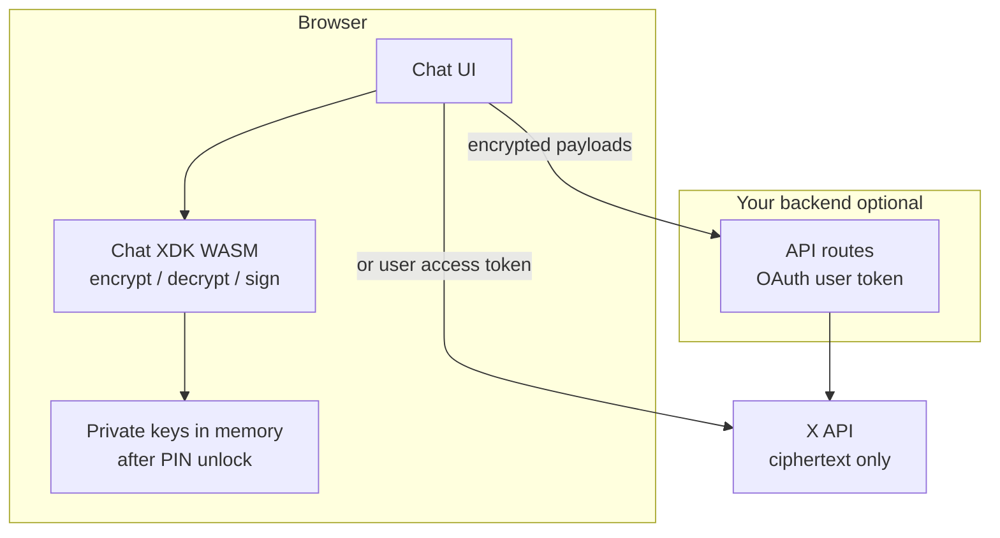

For **user-facing chat UIs**, run the [Chat XDK](/xchat/xchat-xdk) **in the browser** via its JavaScript/WASM package (`@xdevplatform/chat-xdk`). Private identity and signing keys stay on the user's device. Your servers (and X) only ever see **ciphertext**, public keys, and OAuth tokens—not the PIN or private key material used to encrypt and sign messages.

This page is the recommended architecture for client apps. For PIN and key-handling rules that apply to every app type, see [Handling private keys](/xchat/handling-private-keys).

---

## Why WASM for UI apps

| Approach | Where crypto runs | Private keys | Fit |
|:---------|:------------------|:-------------|:----|
| **WASM in the browser** (`createChat`) | User's device | Recovered with PIN into WASM memory; not sent to your backend | **Recommended for chat UIs** |
| **Native Chat XDK on a server** | Your servers | Key blob or passcode-backed recovery on the server | Bots and automation—not end-user chat clients |

End users should **never** paste their encryption PIN into your backend, and your backend should **never** hold their identity private keys. If a third-party server receives a user's PIN or root private keys, that party can decrypt conversation keys wrapped to that identity **even after the user revokes OAuth access**. Client-side WASM avoids that class of failure for legitimate apps.

<Warning>
Sharing a PIN or private key with a third party is like sharing a password for encrypted DMs. OAuth disconnect does **not** revoke keys the app already obtained. Prefer WASM so keys never leave the browser; document risks clearly when you cannot. See [Handling private keys](/xchat/handling-private-keys).
</Warning>

---

## Recommended architecture

Split **crypto** (browser) from **API transport** (your backend or direct X API with a user token):



| Layer | Responsibility |
|:------|:---------------|
| **Browser UI** | Render conversations; collect PIN **only in the client**; call Chat XDK WASM for encrypt/decrypt/sign |
| **Chat XDK WASM** | Key generation, secure key backup (`setup` / `unlock`), message crypto |
| **Your backend (optional)** | Hold the OAuth access token, proxy X Chat REST, mint Juicebox realm auth tokens—**never** receive PIN or private keys |
| **X API** | Public keys, wrapped conversation keys, encrypted events and media |

A common pattern (used by internal demos such as browser chat clients) is: **WASM + React (or similar) in the frontend**, **TypeScript [XDK](/xdks/typescript/overview) in Next.js (or other) API routes** so the browser never talks to `api.x.com` with a long-lived secret if you prefer not to. Crypto still runs only in the browser.

---

## Install the browser package

```bash
npm install @xdevplatform/chat-xdk
npm install juicebox-sdk   # required for setup() / unlock() secure key backup
```

The compiled WASM engine ships inside `@xdevplatform/chat-xdk`; there is no separate Rust toolchain for consumers. Requires a modern browser (and Node.js 18+ if you share code with SSR—run crypto only on the client).

---

## Session flow (PIN once, keys stay in memory)

Do **not** prompt for the PIN on every message. Unlock **once per browser session**, keep the `Chat` instance in memory (module singleton, React context, etc.), then encrypt and decrypt against that unlocked instance.

```typescript
import { createChat } from '@xdevplatform/chat-xdk';

// 1) Create once per page load (client component / browser only)
const chat = await createChat({
  juiceboxConfig: JSON.stringify(record.juicebox_config), // from GET public keys for the user
  getAuthToken: async (realmId) => {
    // Your backend mints a Juicebox realm token for this user + key version.
    // Do not send the user's PIN here—only realm auth for secure key backup.
    const res = await fetch(`/api/juicebox/token?realm=${encodeURIComponent(realmId)}`);
    if (!res.ok) throw new Error('Juicebox token fetch failed');
    return res.text();
  },
});

// 2) First-time identity: generate → register public keys with X → backup with PIN
// const payload = chat.generateKeypairs();
// await registerPublicKeysWithX(payload);  // POST /2/users/:id/public_keys
// await chat.setup(pin);                   // PIN never leaves the browser

// 3) Returning session: recover keys with PIN (once)
await chat.unlock(pin);
chat.setIdentity(userId, signingKeyVersion);
chat.setCacheKeys(true);
// Fetch participants' public keys from X, then:
chat.setSigningKeys(signingKeys);

// 4) Use for the whole SPA session—no more PIN prompts
const result = chat.decryptEvents(rawEvents);
const sendBody = chat.encryptMessage({ conversationId, text: 'Hello' });
// POST sendBody to your backend or X Chat send-message endpoint

// 5) On logout or "lock chat"
chat.lock(); // clears key material from the WASM instance
// chat.free(); // if you will not reuse this instance
```

### UX expectations

| Event | What to do |
|:------|:-----------|
| **App open / hard reload** | User enters PIN → `unlock` → keep instance for navigation within the SPA |
| **Send / receive / media** | Call encrypt/decrypt on the **already unlocked** instance |
| **Logout / switch account** | `lock()` or `free()`; drop references; clear any session state |
| **Forgot PIN / lockout** | Secure key backup enforces a guess limit; recovery may require key reset (new keypairs + re-register). See [Cryptography primer](/xchat/cryptography-primer#secure-key-backup-distributed-key-storage) |

<Tip>
**Avoid re-prompting the PIN on every action.** Demo apps sometimes call `unlock` repeatedly for simplicity. Production UIs should unlock once, hold the instance in memory, and only ask for the PIN again after reload, logout, or `lock()`.
</Tip>

---

## What your server is allowed to see

| Allowed on the server | Never send to the server |
|:----------------------|:-------------------------|
| OAuth 2.0 user access token | Encryption PIN / passcode |
| Juicebox **realm auth tokens** (short-lived, for backup protocol) | Identity or signing **private** keys |
| Public key registration payloads | Raw `export_keys` blobs for end-user identities (browser apps) |
| Encrypted message and media payloads | Plaintext message bodies (unless the user is composing them only in the UI) |
| Conversation ids, event ids, metadata X already stores | Anything that reconstructs the user's root key material |

Realm tokens for Juicebox are **not** the user's PIN. They authorize the backup protocol for that user and key version. Keep minting them on a backend that already holds the user OAuth context.

---

## Secure key backup in the browser

Client apps should use **secure key backup** (`setup` / `unlock` with a passcode), not a raw key file:

1. Load `juicebox_config` from the user's public-key record (`public_key.fields=juicebox_config`).
2. `createChat({ juiceboxConfig, getAuthToken })`.
3. First time: `generateKeypairs` → register public keys with X → `setup(pin)`.
4. Later: `unlock(pin)` on this device (or a new device with the same PIN).

The Chat XDK's browser path recovers keys into WASM and **does not expose raw private-key export on the public `createChat` surface**, so application JavaScript is not encouraged to pull root key bytes into the page. Prefer that model over hand-rolled `localStorage` key dumps.

Full registration and unlock steps: [Getting Started](/xchat/getting-started). Concepts: [Cryptography primer](/xchat/cryptography-primer).

---

## Browser hardening checklist

- Run Chat XDK only in **client** bundles (no SSR of unlocked keys).
- Treat the unlocked `Chat` instance like a live session secret: do not put it on `window`, do not log it, do not post it to analytics.
- Defend against **XSS**: CSP, careful `dangerouslySetInnerHTML` / markdown rendering, dependency hygiene. XSS in a chat app can reach keys in memory even when keys never hit the network.
- Use **HTTPS** everywhere; never mix crypto pages with insecure scripts.
- Prefer **minimal OAuth scopes**; request DM scopes only when needed and explain them in your product UI.
- On logout, call **`lock()`** / **`free()`** and discard the instance.

Storage recommendations (what not to put in `localStorage`, how to think about session persistence) are in [Handling private keys](/xchat/handling-private-keys#browser-session-persistence).

---

## Next steps

1. [Handling private keys](/xchat/handling-private-keys) — PIN warnings, storage, bots vs UI apps  
2. [Getting Started](/xchat/getting-started) — full key registration and first message  
3. [Chat XDK](/xchat/xchat-xdk) — API reference for `createChat`, encrypt, decrypt  
4. [Real-time events](/xchat/real-time-events) — deliver ciphertext to the client for local decrypt  
