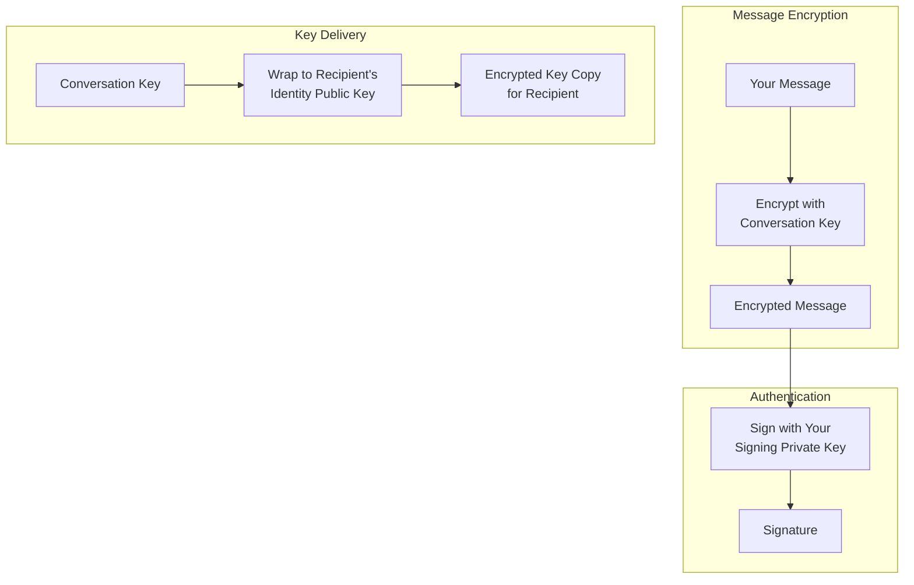
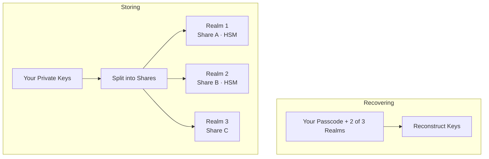

X Chat is end-to-end encrypted: a user's messages, in plaintext, exist only on their devices. This page explains how it works. 

<Note>
**This page is informational. You do not need this knowledge to build (the [Chat XDK](/xchat/xchat-xdk) performs every operation here for you).**
</Note>

---

## The big picture

Let's look at the entire flow from account creation up to sending / receiving messages.

<Steps>
  <Step title="Account creation">
    Here the Chat XDK generates two keypairs on your device:

    - an **identity keypair**, for receiving secrets
    - a **signing keypair**, for proving authorship

    Private halves go to [secure key backup](#secure-key-backup-distributed-key-storage), which we detail later. The important thing here is these are recoverable only with your passcode; X cannot recover them.

    Public halves are published to the X backend via the **public key** API, with a signature tying the identity and signing keys together.
  </Step>
  <Step title="Conversation creation">
    To message you, a sender generates a fresh **conversation key**, a symmetric key that will encrypt the messages. 
    
    They fetch your public key from the X backend, verify the signature on it, and encrypt the conversation key to your identity key. 
    
    This is a crucial property of public key cryptography, anyone can encrypt to your public key; **only your private key can decrypt, and only you hold it**. So X can store and deliver the encrypted copy, but never open it. (For the exact schemes used, see the [glossary](#glossary).)

    Why don't we just encrypt the messages directly to your public key? Speed: public key encryption is much more expensive than symmetric key encryption, so exchanging a key enables better efficiency for subsequent messages.
  </Step>
  <Step title="Messaging">
    When someone messages you, you will receive the conversation key, encrypted with your identity public key, and the messages encrypted with the conversation key.
    
    You use your identity private key to decrypt the conversation key (again, only you hold this key) and then use the resulting conversation key to decrypt the messages.

    Every so often, keys in a conversation rotate (a new symmetric key is shared), for different reasons. Therefore, each conversation key has a version so participants can always know they are using the right key.
  </Step>
  <Step title="Signing">
    Encryption lets anyone send you a message, which only you can decrypt. Signing is, in some sense, the opposite, it lets you (and only you) sign a message, and anyone verify the signature. Practically, the private key is necessary for signing, and the public key can be used for verifying. 
    
    In X Chat, every sender signs their message. Signatures prove both who signed the message and the exact bytes signed, so all recipients can verify that this exact message was what the sender typed. Again, the XDK handles this for you; we cover the details in [Signatures explained](#signatures-explained).
  </Step>
</Steps>

---

## Putting it together

X Chat composes three standard cryptographic tools, each doing the one job it is good at:

1. A **conversation key** encrypts messages: symmetric, fast enough for all message and media traffic.
2. An **identity keypair** delivers conversation keys to each participant without anyone else (including X) seeing them.
3. A **signing keypair** proves authorship: every message carries a signature recipients verify.

X transports and stores only **ciphertext and wrapped keys**, nothing it can open. The XDK does the cryptography; the [Chat API](/xchat/introduction) registers keys and moves encrypted payloads ([Getting Started](/xchat/getting-started)).

The full cast:

| Key | Who holds it | What it does |
|:----|:-------------|:-------------|
| **Identity keypair** | Private half: only you. Public half: published | Receives wrapped conversation keys |
| **Signing keypair** | Private half: only you. Public half: published | Signs messages and state changes; others verify |
| **Conversation key** | Every participant of one conversation | Encrypts messages and media; versioned, rotates |

---

## A worked example

Let's walk through what actually happens when you create a group with Bob and Carol.

<Steps>
  <Step title="Generate the conversation key">
    The XDK generates a fresh random conversation key. So far it exists only in memory on your device.
  </Step>
  <Step title="Fetch and verify participant keys">
    Your app fetches Bob's and Carol's public keys from the X backend and verifies the signature on each. If a signature doesn't check out, you stop; never encrypt to a key you couldn't verify.
  </Step>
  <Step title="Wrap the key to each participant">
    The XDK wraps the conversation key three times: to Bob's identity public key, to Carol's, and to your own (so your other devices can read it too).
  </Step>
  <Step title="Sign the change">
    The XDK signs a payload describing exactly this change: the group, its members, the wrapped keys. Creating a group needs **two** [action signatures](#signed-state-changes-action-signatures); the XDK produces both for you.
  </Step>
  <Step title="Publish">
    Your app POSTs the wrapped copies and signatures to X. The server stores three encrypted blobs it cannot open. At no point did the raw conversation key leave your device!
  </Step>
  <Step title="Bob reads">
    Bob's XDK unwraps his copy with his identity private key, verifies the key change came from you, and holds the raw conversation key.
  </Step>
</Steps>

That's the one-time setup. From here, every message follows the same two flows:

**Sending.** The XDK encrypts your message with the current conversation key, signs it, and your app POSTs both to the **send message** endpoint. X stores and delivers bytes it cannot read.

**Receiving.** Ciphertext arrives via [webhooks or an activity stream](/xchat/real-time-events), or by reading conversation **events** for history. The XDK verifies the sender's signature first, then decrypts with your stored conversation key (if the key rotated, a **key change** event delivers your new wrapped copy). If verification fails, the message is rejected.

Implementation lives in [Getting Started](/xchat/getting-started) and the [Chat XDK](/xchat/xchat-xdk) reference.

---

## Secure key backup: distributed key storage

Earlier we said your private keys are saved to **secure key backup**, recoverable only with your passcode. Let's look at how that works, because it is the part people are most skeptical about: how can keys be backed up without X being able to read them?

### The problem with traditional key storage

| Approach | Problem |
|:---------|:--------|
| Store on device only | Lose the device = lose the keys = lose access to message history |
| Store in an ordinary cloud backup | The provider can access key material |
| Remember a long key | People cannot memorize high-entropy secrets |

### How secure key backup solves it

X Chat uses the open-source [**Juicebox**](https://juicebox.xyz) protocol, which combines **threshold secret sharing** with passcode protection. The full protocol is specified there; the short version:

**Storing (once, at account creation).** The XDK splits your private keys into shares and distributes them to three **realms**, separate services isolated from one another. All three are operated by X, so isolation alone would not mean much. That is where hardware comes in: two of the realms live inside **hardware security modules** (HSMs), tamper-resistant hardware that will not give up its share to anyone, not even an X administrator with full server access. A share on its own reveals nothing, and recovery requires shares from **two of the three** realms, so every possible recovery goes through at least one HSM: there is no software-only path to your keys. The HSM software and the **key ceremony** that provisioned it are publicly documented.

**Recovering (new device).** You enter your passcode, and the XDK proves to each realm that you know it. The Juicebox protocol makes this possible without the passcode ever leaving your device. Each realm that verifies you releases its share of your keys, and once two of the three respond, the XDK puts your keys back together on your device.

**Guess limits.** Each realm allows at most **20 wrong passcode attempts**. On the 20th wrong attempt, your key share is deleted from the realm. This is hardware-enforced by the HSMs and protects against any brute-force attack.

The result: you can recover your keys on a new device with just your passcode, no single realm ever holds the whole secret, and the hardware-backed realms enforce their limits even against X itself.

<Note>
You do not configure any of this by hand. The Chat XDK includes the backup client, and realm configuration arrives from the X backend with your public-key record. Passcode storage and unlock are Chat XDK calls; see [initialize with existing keys](/xchat/getting-started#2-initialize-the-chat-xdk-with-existing-keys) and [create and register keys](/xchat/getting-started#3-create-and-register-keys-first-time-setup). Servers and bots often skip backup and use an exported key blob instead; protect it like a password.
</Note>

---

## Signatures explained

Every message's signature gives recipients two guarantees:

1. **Authenticity**: produced by the holder of the sender's signing private key
2. **Integrity**: the encrypted content was not modified after signing

If anything in the signed content changes, verification fails. Of course, this guarantee is only as strong as the secrecy of the signing key, which is why [key storage](#secure-key-backup-distributed-key-storage) matters so much.

**In your app.** The XDK signs when you encrypt and verifies when you decrypt. Rejection happens at both ends: X Chat itself rejects events it cannot verify, and the XDK does the same on receipt, **mandatory by default** (disabling this is not recommended). Details: [Chat XDK](/xchat/xchat-xdk).

### Signed state changes (action signatures)

Messages are not the only thing signed. Every change to a conversation (creating a group, adding members, rotating a key) must also carry **action signatures**: the sender signs a payload describing exactly what the change does, and the API rejects requests where these are missing or malformed. The XDK produces them for you.

**Why the server cannot fully verify a key change.** The server never holds the raw conversation key (that is the point), so it cannot check a signature over material it cannot see. It checks what it can, that the signed description matches the request, and recipients do the real cryptographic check when they unwrap the key change.

Events are immutable: one that fails verification is permanently invalid. See [Troubleshooting](/xchat/troubleshooting).

---

## Security properties

Here is what X Chat protects against, and just as important, what it does not.

### What X Chat protects against

| Threat | Protection | Resting on |
|:-------|:-----------|:-----------|
| **X reading message bodies** | Content is encrypted before it reaches X | Conversation keys never leave participants' devices unwrapped |
| **Network eavesdroppers** | Transport security plus end-to-end encrypted content | Standard TLS, plus everything above |
| **Message tampering** | Signatures detect any modification | Signature verification on every event |
| **Sender impersonation** | A valid signature requires the sender's signing private key | Signing key secrecy, plus the key binding you verified |
| **Key theft from a backup server** | Shares are split across realms and passcode-gated, with a hard guess limit | No single realm can reconstruct keys; HSMs enforce the guess limit in hardware |

### What X Chat does not protect against, and why

| Limitation | The honest version |
|:-----------|:-------------------|
| **A compromised device** | An unlocked client holds plaintext and raw keys. No end-to-end design survives a compromised endpoint. |
| **Metadata** | X must know who messaged whom, and when, to route ciphertext. Encryption hides the *what*, not the *who* or *when*. |
| **No forward secrecy** | Conversation keys are wrapped to long-lived identity keys: an attacker with your identity private key can unwrap previously captured envelopes, and with them past ciphertext. |
| **No automatic post-compromise healing** | Recovery works, but it is deliberate rather than automatic: removing an attacker rotates the conversation key, and recovering a compromised device usually includes generating a fresh identity key and new conversation keys, so even stolen keys read nothing new. What no rotation can do is rewrite the past, or protect you in the window before the compromise is dealt with. |

---

## Glossary

| Term | Definition |
|:-----|:-----------|
| **Symmetric encryption** | Same key encrypts and decrypts (used for messages and media) |
| **Asymmetric encryption** | Public key to encrypt, private key to decrypt (used to deliver conversation keys) |
| **Public key** | Safe to publish; used to encrypt *to* someone or verify their signatures |
| **Private key** | Must stay secret; used to decrypt or sign |
| **ECDH** | Key *agreement*: two parties derive a shared secret from one's private key and the other's public key |
| **ECIES** | Hybrid encryption built on ECDH: derive a shared secret, encrypt symmetrically under it. How conversation keys are wrapped |
| **ECDSA** | The elliptic-curve signature algorithm used for messages and action signatures |
| **P-256** | The elliptic curve (secp256r1) all X Chat keypairs use |
| **Key binding** | The published signature tying a user's identity key to their signing key; verified before wrapping anything to a fetched record |
| **Conversation key** | Symmetric key shared by the participants of one conversation, versioned over time |
| **Wrapping** | Encrypting one key under another; here, a conversation key under an identity public key |
| **Threshold secret sharing** | Splitting a secret into shares so that only a sufficient subset can reconstruct it; fewer than the threshold learn nothing |
| **Juicebox** | The open-source protocol behind secure key backup: passcode-gated threshold recovery with hard guess limits |
| **HSM** | Hardware security module: tamper-resistant hardware that holds a realm's share and enforces its guess limit |
| **Realm** | A separate, isolated secure key backup service holding one share of your key material |

---

## Next steps

<CardGroup cols={2}>
  <Card title="Getting Started" icon="rocket" href="/xchat/getting-started">
    Implement keys, send, and receive step by step
  </Card>
  <Card title="Chat XDK Reference" icon="code" href="/xchat/xchat-xdk">
    Encryption SDK methods and types
  </Card>
  <Card title="Introduction" icon="book" href="/xchat/introduction">
    Product overview and architecture
  </Card>
  <Card title="Real-time events" icon="bolt" href="/xchat/real-time-events">
    How encrypted events are delivered
  </Card>
</CardGroup>
