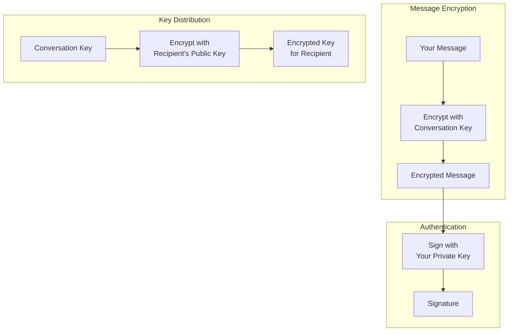
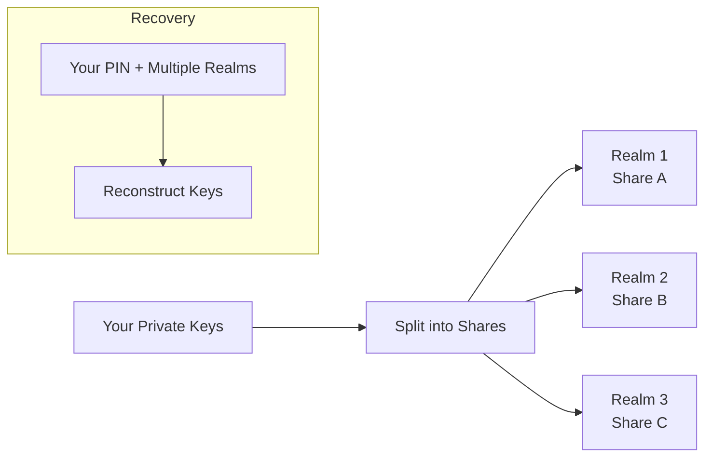

import { Button } from '/snippets/button.mdx';

This primer explains the cryptographic ideas behind X Chat at a conceptual level. You do not need this depth to build—the [Chat XDK](/xchat/xchat-xdk) performs encryption, decryption, signing, and key storage for you—but the mental model helps when you design your app or debug behavior.

When you are ready to implement, use [Getting Started](/xchat/getting-started) for a full walkthrough and the [API reference](/x-api/chat/get-chat-conversations) in the sidebar for individual routes.

<Note>
**You don't implement this cryptography yourself.** The Chat XDK handles it. This page is for understanding, not an API checklist.
</Note>

---

## The big picture

X Chat uses a layered encryption system where:

1. **Messages** are encrypted with a **conversation key** (fast symmetric encryption)
2. **Conversation keys** are encrypted to each participant using their **identity public key** (asymmetric key exchange)
3. **Messages are signed** so recipients can verify who sent them and that nothing was altered

Symmetric encryption is efficient for lots of message traffic; asymmetric encryption is used mainly to **distribute** conversation keys safely.

In the product flow, X transports **ciphertext and key envelopes**—not readable message content or the raw conversation key. Your app uses the Chat XDK for crypto and the [Chat API](/xchat/introduction) (via the XDK in Python/TypeScript, or HTTPS) to register keys and send or receive those encrypted payloads. See [Getting Started](/xchat/getting-started) for how those pieces fit together.

---

## Key types explained

X Chat uses three kinds of key material, each with a specific purpose.

### 1. Identity keypair

**Purpose:** Securely exchange conversation keys between users

| Component | Description |
|:----------|:------------|
| **Identity public key** | Shared with others; used to encrypt conversation keys *to* you |
| **Identity private key** | Kept secret; used to decrypt conversation keys sent *to* you |

When someone adds you to a conversation, they encrypt the conversation key using your identity public key. Only your identity private key can decrypt it.

Public halves are registered and discovered through the platform’s **public-key** APIs (see Encryption keys under API reference). Private halves stay in the Chat XDK (for example via [Juicebox](#juicebox-distributed-key-storage) or a carefully protected key blob).

### 2. Signing keypair

**Purpose:** Prove that you authored a message

| Component | Description |
|:----------|:------------|
| **Signing public key** | Shared with others; used to verify your signatures |
| **Signing private key** | Kept secret; used to sign your messages |

When you send a message, it is signed with your signing private key. Recipients verify using your signing public key (also published through the public-key APIs). The Chat XDK signs as part of encrypting a message and can verify on decrypt when you supply the sender’s public key material.

### 3. Conversation key

**Purpose:** Encrypt and decrypt messages (and media) within a specific conversation

| Property | Description |
|:---------|:------------|
| **Symmetric** | Same key encrypts and decrypts |
| **Per-conversation** | Each conversation has its own key |
| **Shared among participants** | All participants who should read the thread have a copy |
| **Versioned** | Keys can rotate; apps should track versions over time |

Conversation keys are generated when a conversation is set up or when keys rotate. Each participant gets an **encrypted copy** of the key, produced with their identity public key. After you decrypt your copy once, you keep the **raw** conversation key and use it for fast message (and [media](/xchat/media)) encryption. Setting up those copies for a conversation is done through the Chat XDK together with conversation **key** endpoints—walked through in [Getting Started](/xchat/getting-started#4-set-up-conversation-keys).

---

## How encryption works (conceptually)

### Sending a message

<Steps>
  <Step title="Start with plaintext">
    You type: "Hello, how are you?"
  </Step>
  <Step title="Get the conversation key">
    Your app uses the raw conversation key for this chat (from setup or from an earlier key-distribution event), for the right key version.
  </Step>
  <Step title="Encrypt the message">
    The Chat XDK encrypts your message with the conversation key. The result is ciphertext that is useless without that key.
  </Step>
  <Step title="Sign the message">
    The Chat XDK signs the encrypted payload with your signing private key, proving you authored this exact content.
  </Step>
  <Step title="Send to X">
    Your app sends the encrypted payload and signature to X through the Chat API **send message** endpoint. X stores and delivers bytes it cannot read as plaintext.
  </Step>
</Steps>

### Receiving a message

<Steps>
  <Step title="Receive encrypted data">
    Your app receives ciphertext from X—via [webhooks or an activity stream](/xchat/real-time-events), or by reading conversation **events** for history.
  </Step>
  <Step title="Get the conversation key">
    Use your cached raw key, or obtain it by decrypting your copy from a key-distribution (key change) event if this is new or rotated.
  </Step>
  <Step title="Verify the signature">
    The Chat XDK checks the signature using the sender’s signing public key (and related identity binding), so you know who sent it and that it was not modified.
  </Step>
  <Step title="Decrypt the message">
    The Chat XDK decrypts with the conversation key. You can now read: "Hello, how are you?"
  </Step>
</Steps>

Implementation of encrypt, send, receive, and decrypt is in [Getting Started](/xchat/getting-started) and the [Chat XDK](/xchat/xchat-xdk) reference.

---

## Key distribution explained

A central challenge in end-to-end encryption is **key distribution**: how participants get the conversation key **without** X (or an observer) seeing that key in the clear.

### Initial key setup

When a conversation is prepared for messaging:

1. A random conversation key is generated (in the Chat XDK)
2. For **each participant**, that key is encrypted to their **identity public key**
3. Those encrypted copies are stored and delivered through X’s Chat APIs
4. Each participant decrypts **their** copy with their identity private key (in the Chat XDK)

X only ever handles the **wrapped** copies, not the raw conversation key.

### Key change events

When the conversation key rotates (for example when membership changes), participants receive a **key change** event with new encrypted copies for each member.

Your app should:

1. Notice key-change material on live events or in conversation history
2. Decrypt and store the new conversation key (and version)
3. Use the latest version for subsequent sends

[Getting Started](/xchat/getting-started#6-receive-and-decrypt) and [Real-time events](/xchat/real-time-events) describe where those events appear in practice.

---

## Juicebox: Distributed key storage

Your **private** identity and signing keys must be stored carefully. X Chat integrates **Juicebox** so keys can be recovered with a PIN across devices without giving any single server the full secret.

### The problem with traditional key storage

| Approach | Problem |
|:---------|:--------|
| Store on device only | Lose the device = lose the keys = lose access to message history |
| Store in an ordinary cloud backup | The provider might access key material |
| Remember a long key | People cannot reliably memorize high-entropy keys |

### How Juicebox solves it

Juicebox combines **secret sharing** with **PIN protection**:

1. Private keys are **split into shares**
2. Shares are held by **independent realms** (separate servers)
3. **No single realm** has enough information to reconstruct the keys alone
4. Recovery requires your **PIN** and cooperation from **enough realms**
5. Wrong PINs are **rate-limited** to slow guessing

You get recoverability (new device + PIN) without a single party holding the whole secret.

<Note>
You do not configure Juicebox servers by hand for the normal path. The Chat XDK includes the Juicebox client; realm configuration comes from the X API as **`juicebox_config`** on your public-key record. First-time PIN storage and later unlock are Chat XDK calls—see [Getting Started](/xchat/getting-started#2-initialize-the-chat-xdk) and [register public keys](/xchat/getting-started#3-register-public-keys-one-time). Some apps (especially servers and bots) use an exported key blob instead of Juicebox; protect that material like a password.
</Note>

---

## Signatures explained

Every X Chat message includes a **digital signature** that supports:

1. **Authenticity** — it was produced with the sender’s signing private key  
2. **Integrity** — the encrypted content was not modified after signing  

### How signatures work (conceptually)

| Action | Key used | Result |
|:-------|:---------|:-------|
| **Sign** | Sender’s signing private key | A signature bound to this exact encrypted message |
| **Verify** | Sender’s signing public key | Confirms the signature matches the message and key |

If anything in the signed material changes, verification fails. Only someone with the signing private key can produce a valid signature for that key.

### In your app

The Chat XDK signs when you encrypt outbound messages and verifies when you decrypt inbound ones—**if** you provide the sender’s public key material (from the public-key APIs). Results typically include a **verified** flag; you can treat unverified messages as suspicious or configure the SDK to reject them. Details are in the [Chat XDK](/xchat/xchat-xdk) reference.

---

## Security properties

### What X Chat protects against

| Threat | Protection |
|:-------|:-----------|
| **X reading message bodies** | Content is encrypted before it is sent to X |
| **Network eavesdroppers** | Transport security plus end-to-end encrypted content |
| **Message tampering** | Signatures detect modification |
| **Trivial sender impersonation** | Valid signatures require the sender’s signing private key |
| **Single-server key theft (with Juicebox)** | Shares are split across realms and PIN-gated |

### What X Chat does **not** protect against

| Threat | Why not |
|:-------|:--------|
| **Compromised device** | Plaintext and keys may be exposed on an unlocked client |
| **Metadata** | X can know who messaged whom and when—not the message text |
| **Forward secrecy** | Compromise of identity keys can expose conversation keys that were wrapped to those keys |
| **Post-compromise security** | Rotating keys does not rewrite history |

---

## Glossary

| Term | Definition |
|:-----|:-----------|
| **Symmetric encryption** | Same key encrypts and decrypts (used for messages and media streams) |
| **Asymmetric encryption** | Different keys for encrypt vs decrypt (used to wrap conversation keys) |
| **Public key** | Safe to share; used to encrypt *to* someone or verify their signatures |
| **Private key** | Must stay secret; used to decrypt or sign |
| **Keypair** | A linked public key and private key |
| **ECDH / ECIES** | Algorithms used when wrapping conversation keys to identity keys |
| **ECDSA** | Signature algorithm used for message authorship |
| **P-256** | Elliptic curve used in X Chat (secp256r1) |
| **Conversation key** | Symmetric key shared by participants in one conversation (versioned over time) |
| **Secret sharing** | Splitting a secret so multiple pieces are needed to reconstruct it |
| **Realm** | An independent Juicebox server holding one share of your key material |

---

## Next steps

<CardGroup cols={2}>
  <Card title="Getting Started" icon="rocket" href="/xchat/getting-started">
    Implement keys, send, and receive step by step
  </Card>
  <Card title="Chat XDK Reference" icon="code" href="/xchat/xchat-xdk">
    Encryption SDK methods and types
  </Card>
  <Card title="Introduction" icon="book" href="/xchat/introduction">
    Product overview and architecture
  </Card>
  <Card title="Real-time events" icon="bolt" href="/xchat/real-time-events">
    How encrypted events are delivered
  </Card>
</CardGroup>
