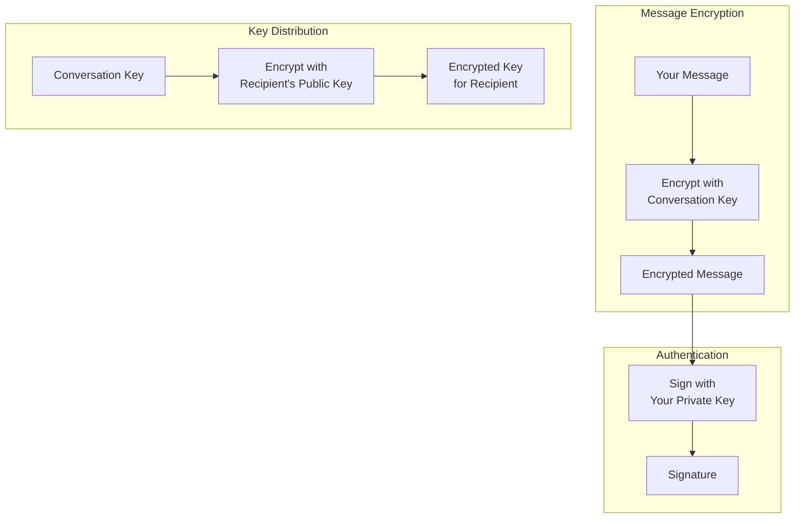
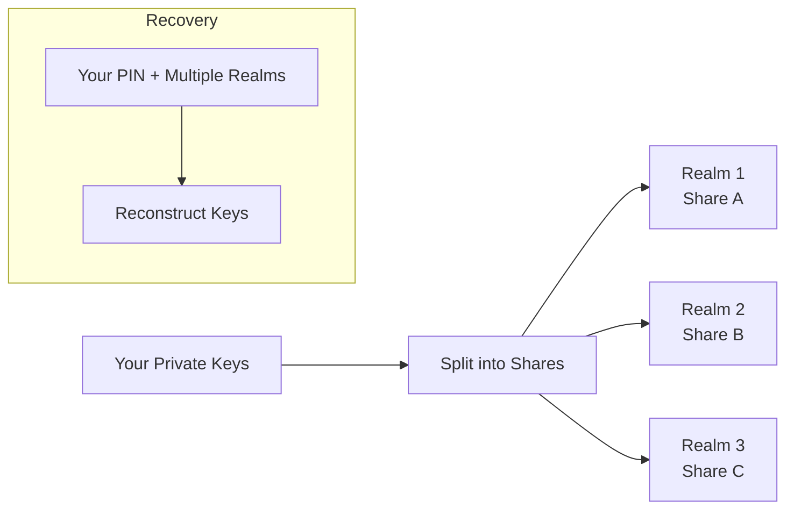

import { Button } from '/snippets/button.mdx';

This primer explains the cryptographic concepts behind Chat at a conceptual level. You don't need to understand the technical details to build with Chat — the SDKs handle all cryptographic operations for you — but understanding the concepts helps you make better architectural decisions.

<Note>
**You don't need to implement any of this yourself.** The Chat XDK handles all encryption, decryption, key management, and signatures. This document is for understanding, not implementation.
</Note>

---

## The big picture

Chat uses a layered encryption system where:

1. **Messages** are encrypted with a **conversation key** (fast symmetric encryption)
2. **Conversation keys** are encrypted to each participant using their **public key** (slower asymmetric encryption)
3. **All messages** are **signed** to prove authenticity

This design is efficient because symmetric encryption is fast (good for messages) while asymmetric encryption is secure for key exchange.

---

## Key types explained

Chat uses three types of keys, each with a specific purpose:

### 1. Identity keypair

**Purpose:** Securely exchange conversation keys between users

| Component | Description |
|:----------|:------------|
| **Identity public key** | Shared with others; used to encrypt conversation keys *to* you |
| **Identity private key** | Kept secret; used to decrypt conversation keys sent *to* you |

When someone wants to add you to a conversation, they encrypt the conversation key using your identity public key. Only your identity private key can decrypt it.

### 2. Signing keypair

**Purpose:** Prove that you authored a message

| Component | Description |
|:----------|:------------|
| **Signing public key** | Shared with others; used to verify your signatures |
| **Signing private key** | Kept secret; used to sign your messages |

When you send a message, you sign it with your signing private key. Recipients verify the signature using your signing public key.

### 3. Conversation key

**Purpose:** Encrypt and decrypt messages within a specific conversation

| Property | Description |
|:---------|:------------|
| **Symmetric** | Same key encrypts and decrypts |
| **Per-conversation** | Each conversation has its own key |
| **Shared among participants** | All participants have the same key |

Conversation keys are randomly generated when a conversation is created or when keys are rotated. They're distributed to participants by encrypting a copy of the key to each participant's identity public key.

---

## How encryption works (conceptually)

### Sending a message

<Steps>
  <Step title="Start with plaintext">
    You type: "Hello, how are you?"
  </Step>
  <Step title="Get the conversation key">
    Your app retrieves the conversation key for this chat (decrypting it with your identity private key if needed).
  </Step>
  <Step title="Encrypt the message">
    The Chat XDK encrypts your message using the conversation key. The result is random-looking bytes that can only be decrypted with the same key.
  </Step>
  <Step title="Sign the message">
    The Chat XDK signs the encrypted message with your signing private key. This creates a digital signature that proves you authored this exact message.
  </Step>
  <Step title="Send to X">
    Your app sends the encrypted message + signature to X via the API. X stores and delivers it without being able to read the contents.
  </Step>
</Steps>

### Receiving a message

<Steps>
  <Step title="Receive encrypted data">
    Your app receives an encrypted message from X (via webhook, stream, or polling).
  </Step>
  <Step title="Get the conversation key">
    Your app retrieves the conversation key for this chat. If this is your first message in the conversation, you'll need to decrypt your copy of the conversation key using your identity private key.
  </Step>
  <Step title="Verify the signature">
    The Chat XDK verifies the signature using the sender's signing public key. This confirms the message came from the claimed sender and wasn't tampered with.
  </Step>
  <Step title="Decrypt the message">
    The Chat XDK decrypts the message using the conversation key. You can now read: "Hello, how are you?"
  </Step>
</Steps>

---

## Key distribution explained

One of the trickier parts of end-to-end encryption is **key distribution** — how do participants get the conversation key securely?

### Initial key setup

When a conversation is created:

1. A random conversation key is generated
2. For **each participant**, the conversation key is encrypted using that participant's identity public key
3. Each participant receives their own encrypted copy of the conversation key
4. Each participant decrypts their copy using their identity private key

This means X never sees the conversation key in plaintext — it only transports encrypted copies.

### Key change events

When the conversation key is rotated (e.g., when someone joins or leaves a group), a `KeyChange` event is sent containing new encrypted copies of the conversation key for each participant.

Your app should:
1. Detect `KeyChange` events
2. Extract and decrypt the new conversation key
3. Store it for future messages

---

## Juicebox: Distributed key storage

Your private keys (identity and signing) need to be stored securely. Chat uses **Juicebox** for this.

### The problem with traditional key storage

| Approach | Problem |
|:---------|:--------|
| Store on device only | Lose your device = lose your keys = lose access to all messages |
| Store in cloud backup | Cloud provider can access your keys |
| Remember a long key | Humans can't remember 256-bit keys |

### How Juicebox solves it

Juicebox uses a technique called **secret sharing** combined with PIN protection:

1. Your private keys are **split into pieces** (called "shares")
2. Each piece is sent to a **different independent server** (called "realms")
3. **No single server** has enough information to reconstruct your keys
4. To recover your keys, you need to:
   - Provide your **PIN**
   - Contact **multiple servers** simultaneously
5. Wrong PINs are rate-limited to prevent brute-force attacks

This gives you the best of both worlds:
- **Recoverable**: You can recover your keys on a new device with just your PIN
- **Secure**: No single party (including Juicebox operators) can access your keys

---

## Signatures explained

Every Chat message includes a **digital signature** that proves:

1. **Authenticity**: The message was created by the claimed sender
2. **Integrity**: The message hasn't been modified since signing

### How signatures work (conceptually)

| Action | Key Used | Result |
|:-------|:---------|:-------|
| **Sign** | Sender's signing private key | Creates a unique signature for this exact message |
| **Verify** | Sender's signing public key | Confirms signature matches the message and key |

If anyone modifies even a single character of the message, the signature verification will fail. And since only the sender has the signing private key, no one else can create a valid signature.

### Signature verification in your app

When you receive a message, the Chat XDK automatically:

1. Extracts the signature from the message
2. Retrieves the sender's signing public key
3. Verifies that the signature is valid for the message content
4. Returns a `verified: true` or `verified: false` flag

You can configure the SDK to reject unverified messages automatically or handle them in your application logic.

---

## Security properties

### What Chat protects against

| Threat | Protection |
|:-------|:-----------|
| **X reading messages** | Messages are encrypted before reaching X servers |
| **Network eavesdroppers** | Encrypted in transit + encrypted content |
| **Message tampering** | Signatures detect any modification |
| **Sender impersonation** | Only the real sender can create valid signatures |
| **Unauthorized access to keys** | Keys stored in distributed Juicebox system |

### What Chat does NOT protect against

| Threat | Why Not |
|:-------|:--------|
| **Compromised device** | If your device is compromised, attackers may access decrypted messages |
| **Metadata** | X knows who is messaging whom and when (just not the content) |
| **Forward secrecy** | If your identity key is compromised, past conversation keys could be decrypted |
| **Post-compromise security** | Key rotation doesn't retroactively protect past messages |

---

## Glossary

| Term | Definition |
|:-----|:-----------|
| **Symmetric encryption** | Same key encrypts and decrypts (fast, used for messages) |
| **Asymmetric encryption** | Different keys for encrypt vs decrypt (slower, used for key exchange) |
| **Public key** | Can be shared with anyone; used to encrypt *to* someone or verify their signatures |
| **Private key** | Must be kept secret; used to decrypt or sign |
| **Keypair** | A mathematically linked public key + private key |
| **ECDH** | Elliptic Curve Diffie-Hellman; the algorithm used for key agreement |
| **ECDSA** | Elliptic Curve Digital Signature Algorithm; used for signatures |
| **P-256** | The specific elliptic curve used (also called secp256r1) |
| **Conversation key** | The symmetric key shared by all participants in a conversation |
| **Secret sharing** | Splitting a secret into pieces where you need multiple pieces to reconstruct |
| **Realm** | An independent server in the Juicebox system that holds one share of your keys |

---

## Next steps

<CardGroup cols={2}>
  <Card title="Getting Started" icon="rocket" href="/xchat/getting-started">
    Build your first Chat application step-by-step
  </Card>
  <Card title="Chat XDK Reference" icon="code" href="/xchat/xchat-xdk">
    Full API reference for the encryption SDK
  </Card>
</CardGroup>
