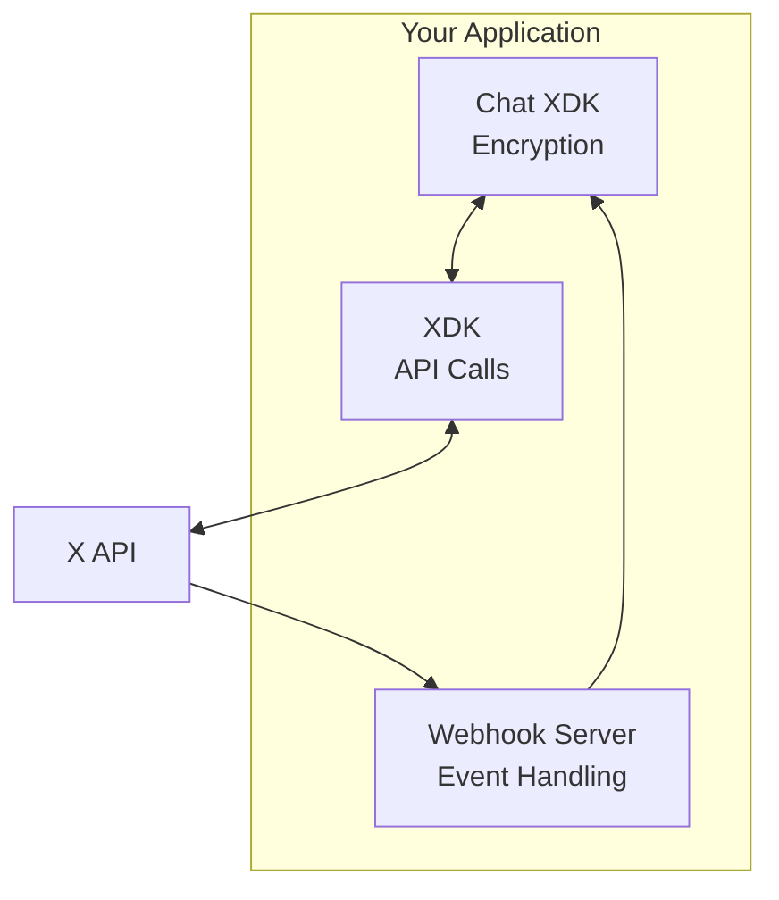

import { Button } from '/snippets/button.mdx';

This guide walks you through building an Chat application that can send and receive end-to-end encrypted direct messages. By the end, you'll have a working application that can:

- Generate and securely store encryption keys
- Send encrypted messages
- Receive and decrypt incoming messages via webhooks

<Note>
**Prerequisites**

Before you begin, you'll need:
- An approved [developer account](https://developer.x.com/en/portal/petition/essential/basic-info)
- A [Project and App](/resources/fundamentals/developer-apps) in the Developer Console
- Juicebox configuration (provided by your X account representative)
- OAuth 2.0 credentials with `dm.read`, `dm.write`, and `media.write` scopes
- Python 3.9+ or Node.js 18+
</Note>

---

## Architecture overview

Your Chat application needs three components:



| Component | Purpose |
|:----------|:--------|
| **Chat XDK** | Handles all encryption, decryption, and key management |
| **XDK** | Makes API calls to `/2/chat/*` endpoints |
| **Webhook Server** | Receives real-time chat events from X Activity API |

---

## Step 1: Install dependencies

<Tabs>
  <Tab title="Python">
    ```bash
    # Install the XDK and Chat XDK
    pip install xdk chat-xdk
    ```
  </Tab>
  <Tab title="TypeScript">
    ```bash
    # Install the XDK and Chat XDK
    npm install xdk chat-xdk
    ```
  </Tab>
</Tabs>

---

## Step 2: Initialize the SDKs

Create a main application file and initialize both SDKs.

<Tabs>
  <Tab title="Python">
    ```python
    from xdk import Client
    from chat_xdk import Chat

    # Initialize the XDK with OAuth 2.0 credentials
    x_client = Client(
        access_token="YOUR_OAUTH2_ACCESS_TOKEN",
        # Or use OAuth 1.0a:
        # api_key="YOUR_API_KEY",
        # api_secret="YOUR_API_SECRET",
        # access_token="YOUR_ACCESS_TOKEN",
        # access_token_secret="YOUR_ACCESS_TOKEN_SECRET"
    )

    # Initialize the Chat XDK with Juicebox configuration
    # You'll receive this JSON config from your X account representative
    juicebox_config = """
    {
      "realms": [
        {
          "address": "https://realm1.juicebox.xyz",
          "id": "realm1_id",
          "public_key": "realm1_public_key"
        },
        {
          "address": "https://realm2.juicebox.xyz",
          "id": "realm2_id"
        }
      ],
      "register_threshold": 2,
      "recover_threshold": 2,
      "pin_hashing_mode": "Standard2019"
    }
    """

    chat = Chat(juicebox_config)
    ```
  </Tab>
  <Tab title="TypeScript">
    ```typescript
    import { Client } from 'xdk';
    import { createChat } from 'chat-xdk';

    // Initialize the XDK with OAuth 2.0 credentials
    const xClient = new Client({
      accessToken: 'YOUR_OAUTH2_ACCESS_TOKEN',
      // Or use OAuth 1.0a:
      // apiKey: 'YOUR_API_KEY',
      // apiSecret: 'YOUR_API_SECRET',
      // accessToken: 'YOUR_ACCESS_TOKEN',
      // accessTokenSecret: 'YOUR_ACCESS_TOKEN_SECRET'
    });

    // Initialize the Chat XDK with Juicebox configuration
    const juiceboxConfig = `{
      "realms": [
        {
          "address": "https://realm1.juicebox.xyz",
          "id": "realm1_id",
          "public_key": "realm1_public_key"
        },
        {
          "address": "https://realm2.juicebox.xyz",
          "id": "realm2_id"
        }
      ],
      "register_threshold": 2,
      "recover_threshold": 2,
      "pin_hashing_mode": "Standard2019"
    }`;

    const chat = await createChat({
      juiceboxConfig,
      getAuthToken: async (realmId) => {
        // Return auth tokens for each realm
        // This should call your backend to get fresh tokens
        return await getTokenForRealm(realmId);
      }
    });
    ```
  </Tab>
</Tabs>

---

## Step 3: Generate and register encryption keys

Before you can send or receive encrypted messages, you need to generate encryption keys and register them with X.

<Tabs>
  <Tab title="Python">
    ```python
    # First-time setup: Generate new keypairs
    def setup_encryption_keys(pin: str):
        # Generate identity and signing keypairs
        registration_payload = chat.generate_keypairs()
        
        # Register public keys with X API
        # The payload contains everything X needs to know about your public keys
        response = x_client.chat.add_public_key(
            body=registration_payload
        )
        print(f"Public keys registered: {response}")
        
        # Store keys securely in Juicebox with your PIN
        # This is the only time you need to call setup()
        public_keys = chat.setup(pin)
        print(f"Keys stored with fingerprint: {chat.get_public_key_fingerprint()}")
        
        return public_keys

    # Run first-time setup
    setup_encryption_keys("1234")  # Use a strong PIN in production!
    ```
  </Tab>
  <Tab title="TypeScript">
    ```typescript
    // First-time setup: Generate new keypairs
    async function setupEncryptionKeys(pin: string) {
      // Generate identity and signing keypairs
      const registrationPayload = chat.generateKeypairs();
      
      // Register public keys with X API
      const response = await xClient.chat.addPublicKey({
        body: registrationPayload
      });
      console.log('Public keys registered:', response);
      
      // Store keys securely in Juicebox with your PIN
      const publicKeys = await chat.setup(pin);
      console.log('Keys stored with fingerprint:', chat.getPublicKeyFingerprint());
      
      return publicKeys;
    }

    // Run first-time setup
    await setupEncryptionKeys('1234'); // Use a strong PIN in production!
    ```
  </Tab>
</Tabs>

<Warning>
**Key storage is critical.** After calling `setup()`, your private keys are securely stored in Juicebox. You'll need your PIN to access them later. If you lose your PIN and can't recover your keys, you won't be able to decrypt past or future messages.
</Warning>

---

## Step 4: Unlock keys on startup

After initial setup, you need to unlock your keys each time your application starts.

<Tabs>
  <Tab title="Python">
    ```python
    def unlock_keys(pin: str):
        """Unlock keys from Juicebox storage on app startup."""
        chat.unlock(pin)
        print(f"Keys unlocked. Fingerprint: {chat.get_public_key_fingerprint()}")
        print(f"Is unlocked: {chat.is_unlocked()}")

    # On application startup
    unlock_keys("1234")
    ```
  </Tab>
  <Tab title="TypeScript">
    ```typescript
    async function unlockKeys(pin: string) {
      // Unlock keys from Juicebox storage on app startup
      await chat.unlock(pin);
      console.log('Keys unlocked. Fingerprint:', chat.getPublicKeyFingerprint());
      console.log('Is unlocked:', chat.isUnlocked());
    }

    // On application startup
    await unlockKeys('1234');
    ```
  </Tab>
</Tabs>

---

## Step 5: Send an encrypted message

Now you can send encrypted messages to a conversation.

<Tabs>
  <Tab title="Python">
    ```python
    def send_message(conversation_id: str, text: str):
        """Send an encrypted message to a conversation."""
        
        # First, get the conversation to retrieve the encrypted conversation key
        conversation = x_client.chat.get_conversation(conversation_id)
        
        # Get the encrypted conversation key for the authenticated user
        # This comes from the API response
        encrypted_conv_key = conversation.data.participant_keys[0].encrypted_key
        
        # Encrypt the message using the Chat XDK
        # The SDK decrypts the conversation key internally and encrypts the message
        send_payload = chat.encrypt_message(
            text=text,
            conversation_key=encrypted_conv_key,
            conversation_id=conversation_id,
            sender_id="YOUR_USER_ID",  # The authenticated user's ID
            should_notify=True
        )
        
        # Send the encrypted payload via the X API
        response = x_client.chat.send_message(
            conversation_id=conversation_id,
            body={
                "encrypted_content": send_payload.encrypted_content,
                "signature": send_payload.signature,
                "encoded_event_signature": send_payload.encoded_event_signature,
                "conversation_key_version": send_payload.conversation_key_version,
                "should_notify": send_payload.should_notify
            }
        )
        
        print(f"Message sent! Event ID: {response.data.id}")
        return response

    # Send a message
    send_message("CONVERSATION_ID", "Hello! This is an encrypted message.")
    ```
  </Tab>
  <Tab title="TypeScript">
    ```typescript
    async function sendMessage(conversationId: string, text: string) {
      // First, get the conversation to retrieve the encrypted conversation key
      const conversation = await xClient.chat.getConversation(conversationId);
      
      // Get the encrypted conversation key for the authenticated user
      const encryptedConvKey = conversation.data.participantKeys[0].encryptedKey;
      
      // Encrypt the message using the Chat XDK
      const sendPayload = chat.encryptMessage({
        text,
        conversationKey: encryptedConvKey,
        conversationId,
        senderId: 'YOUR_USER_ID',
        shouldNotify: true
      });
      
      // Send the encrypted payload via the X API
      const response = await xClient.chat.sendMessage(conversationId, {
        body: {
          encryptedContent: sendPayload.encryptedContent,
          signature: sendPayload.signature,
          encodedEventSignature: sendPayload.encodedEventSignature,
          conversationKeyVersion: sendPayload.conversationKeyVersion,
          shouldNotify: sendPayload.shouldNotify
        }
      });
      
      console.log('Message sent! Event ID:', response.data.id);
      return response;
    }

    // Send a message
    await sendMessage('CONVERSATION_ID', 'Hello! This is an encrypted message.');
    ```
  </Tab>
</Tabs>

---

## Step 6: Set up webhook for real-time events

To receive messages in real-time, set up a webhook endpoint and subscribe to chat events using the X Activity API.

### 6.1 Create a webhook endpoint

<Tabs>
  <Tab title="Python (Flask)">
    ```python
    from flask import Flask, request, jsonify
    import hmac
    import hashlib
    import base64

    app = Flask(__name__)

    # Your app's consumer secret for CRC validation
    CONSUMER_SECRET = "YOUR_CONSUMER_SECRET"

    # Store conversation keys in memory (use a database in production)
    conversation_keys = {}

    @app.route('/webhook', methods=['GET', 'POST'])
    def webhook():
        if request.method == 'GET':
            # Handle CRC challenge
            crc_token = request.args.get('crc_token')
            if crc_token:
                signature = hmac.new(
                    CONSUMER_SECRET.encode(),
                    crc_token.encode(),
                    hashlib.sha256
                ).digest()
                response_token = base64.b64encode(signature).decode()
                return jsonify({'response_token': f'sha256={response_token}'})
            return 'OK', 200
        
        if request.method == 'POST':
            # Verify signature header
            signature = request.headers.get('x-twitter-webhooks-signature', '')
            payload = request.get_data()
            
            expected = 'sha256=' + base64.b64encode(
                hmac.new(CONSUMER_SECRET.encode(), payload, hashlib.sha256).digest()
            ).decode()
            
            if not hmac.compare_digest(signature, expected):
                return 'Invalid signature', 403
            
            # Process the event
            event_data = request.json
            handle_chat_event(event_data)
            return 'OK', 200

    def handle_chat_event(event_data):
        """Process incoming chat events."""
        event_type = event_data.get('event_type')
        payload = event_data.get('payload', {})
        
        if event_type in ['chat.received', 'chat.sent']:
            # Extract encrypted event data
            encrypted_event = payload.get('encrypted_event')
            conversation_id = payload.get('conversation_id')
            
            # Get or extract conversation keys
            if 'key_change' in payload:
                # New conversation key - extract and store it
                key_events = [payload['key_change']['encrypted_event']]
                conv_keys = chat.extract_conversation_keys(key_events)
                conversation_keys[conversation_id] = conv_keys
            
            # Get stored conversation keys for this conversation
            conv_keys = conversation_keys.get(conversation_id, {})
            
            # Decrypt the event
            event = chat.decrypt_event(
                encrypted_event,
                conv_keys,
                []  # Signing keys for verification (optional)
            )
            
            if event.get('type') == 'Message':
                content = event.get('content', {})
                if content.get('content_type') == 'Text':
                    print(f"Received message: {content.get('text')}")
                    print(f"From: {event.get('sender_id')}")
                    print(f"Verified: {event.get('verified')}")

    if __name__ == '__main__':
        app.run(port=5000, ssl_context='adhoc')  # Use proper SSL in production
    ```
  </Tab>
  <Tab title="TypeScript (Express)">
    ```typescript
    import express from 'express';
    import crypto from 'crypto';

    const app = express();
    app.use(express.json({ verify: (req, res, buf) => { (req as any).rawBody = buf; }}));

    const CONSUMER_SECRET = 'YOUR_CONSUMER_SECRET';

    // Store conversation keys in memory (use a database in production)
    const conversationKeys = new Map<string, Record<string, Uint8Array>>();

    app.get('/webhook', (req, res) => {
      // Handle CRC challenge
      const crcToken = req.query.crc_token as string;
      if (crcToken) {
        const hmac = crypto.createHmac('sha256', CONSUMER_SECRET);
        hmac.update(crcToken);
        const responseToken = 'sha256=' + hmac.digest('base64');
        return res.json({ response_token: responseToken });
      }
      res.send('OK');
    });

    app.post('/webhook', (req, res) => {
      // Verify signature
      const signature = req.headers['x-twitter-webhooks-signature'] as string;
      const payload = (req as any).rawBody;
      
      const expected = 'sha256=' + crypto
        .createHmac('sha256', CONSUMER_SECRET)
        .update(payload)
        .digest('base64');
      
      if (!crypto.timingSafeEqual(Buffer.from(signature), Buffer.from(expected))) {
        return res.status(403).send('Invalid signature');
      }
      
      // Process the event
      handleChatEvent(req.body);
      res.send('OK');
    });

    async function handleChatEvent(eventData: any) {
      const eventType = eventData.event_type;
      const payload = eventData.payload || {};
      
      if (eventType === 'chat.received' || eventType === 'chat.sent') {
        const encryptedEvent = payload.encrypted_event;
        const conversationId = payload.conversation_id;
        
        // Get or extract conversation keys
        if (payload.key_change) {
          const keyEvents = [payload.key_change.encrypted_event];
          const convKeys = chat.extractConversationKeys(keyEvents);
          conversationKeys.set(conversationId, convKeys);
        }
        
        const convKeys = conversationKeys.get(conversationId) || {};
        
        // Decrypt the event
        const event = chat.decryptEvent(encryptedEvent, convKeys);
        
        if (event.type === 'Message') {
          const content = event.content;
          if (content.contentType === 'Text') {
            console.log('Received message:', content.text);
            console.log('From:', event.senderId);
            console.log('Verified:', event.verified);
          }
        }
      }
    }

    app.listen(5000, () => console.log('Webhook server running on port 5000'));
    ```
  </Tab>
</Tabs>

### 6.2 Register the webhook

```bash
# Register your webhook URL
curl -X POST "https://api.x.com/2/webhooks" \
  -H "Authorization: Bearer YOUR_BEARER_TOKEN" \
  -H "Content-Type: application/json" \
  -d '{
    "url": "https://your-domain.com/webhook"
  }'
```

### 6.3 Subscribe to chat events

```bash
# Create subscription for chat.received events
curl -X POST "https://api.x.com/2/activity/subscriptions" \
  -H "Authorization: Bearer YOUR_BEARER_TOKEN" \
  -H "Content-Type: application/json" \
  -d '{
    "event_type": "chat.received",
    "filter": {
      "user_id": "YOUR_USER_ID"
    },
    "webhook_id": "YOUR_WEBHOOK_ID"
  }'

# Create subscription for chat.sent events (to track your own messages)
curl -X POST "https://api.x.com/2/activity/subscriptions" \
  -H "Authorization: Bearer YOUR_BEARER_TOKEN" \
  -H "Content-Type: application/json" \
  -d '{
    "event_type": "chat.sent",
    "filter": {
      "user_id": "YOUR_USER_ID"
    },
    "webhook_id": "YOUR_WEBHOOK_ID"
  }'
```

---

## Step 7: Handle key changes

When a conversation key is rotated (new participant, someone leaves, etc.), you'll receive a `KeyChange` event. Your app must handle these to continue decrypting messages.

<Tabs>
  <Tab title="Python">
    ```python
    def handle_key_change_event(event_data):
        """Handle key change events and update stored keys."""
        payload = event_data.get('payload', {})
        encrypted_event = payload.get('encrypted_event')
        conversation_id = payload.get('conversation_id')
        
        # Decrypt the key change event
        event = chat.decrypt_event(encrypted_event, None, [])
        
        if event.get('type') == 'KeyChange':
            key_version = event.get('key_version')
            participant_keys = event.get('participant_keys', [])
            
            # Find your encrypted key
            for pk in participant_keys:
                if pk['user_id'] == 'YOUR_USER_ID':
                    # Decrypt and store the new conversation key
                    conv_key = chat.decrypt_conversation_key(pk['encrypted_key'])
                    
                    # Store with version for future message decryption
                    if conversation_id not in conversation_keys:
                        conversation_keys[conversation_id] = {}
                    conversation_keys[conversation_id][key_version] = conv_key
                    
                    print(f"Updated conversation key for {conversation_id}, version {key_version}")
                    break
    ```
  </Tab>
  <Tab title="TypeScript">
    ```typescript
    function handleKeyChangeEvent(eventData: any) {
      const payload = eventData.payload || {};
      const encryptedEvent = payload.encrypted_event;
      const conversationId = payload.conversation_id;
      
      // Decrypt the key change event (no conversation key needed)
      const event = chat.decryptEvent(encryptedEvent, {});
      
      if (event.type === 'KeyChange') {
        const keyVersion = event.keyVersion;
        const participantKeys = event.participantKeys || [];
        
        // Find your encrypted key
        for (const pk of participantKeys) {
          if (pk.userId === 'YOUR_USER_ID') {
            // Decrypt and store the new conversation key
            const convKey = chat.decryptConversationKey(pk.encryptedKey);
            
            // Store with version for future message decryption
            const existing = conversationKeys.get(conversationId) || {};
            existing[keyVersion] = convKey;
            conversationKeys.set(conversationId, existing);
            
            console.log(`Updated conversation key for ${conversationId}, version ${keyVersion}`);
            break;
          }
        }
      }
    }
    ```
  </Tab>
</Tabs>

---

## Complete example: Customer service bot

Here's a complete example that brings everything together into a simple customer service bot:

<Tabs>
  <Tab title="Python">
    ```python
    from flask import Flask, request, jsonify
    from xdk import Client
    from chat_xdk import Chat
    import hmac
    import hashlib
    import base64

    # Configuration
    CONSUMER_SECRET = "YOUR_CONSUMER_SECRET"
    USER_ID = "YOUR_USER_ID"

    # Initialize SDKs
    x_client = Client(access_token="YOUR_ACCESS_TOKEN")
    chat = Chat(JUICEBOX_CONFIG)

    # Storage
    conversation_keys = {}

    app = Flask(__name__)

    @app.before_first_request
    def startup():
        """Unlock encryption keys on startup."""
        chat.unlock("1234")  # Use secure PIN management in production
        print("Encryption keys unlocked")

    @app.route('/webhook', methods=['GET', 'POST'])
    def webhook():
        if request.method == 'GET':
            # CRC challenge
            crc_token = request.args.get('crc_token')
            if crc_token:
                sig = hmac.new(CONSUMER_SECRET.encode(), crc_token.encode(), hashlib.sha256).digest()
                return jsonify({'response_token': f'sha256={base64.b64encode(sig).decode()}'})
            return 'OK'
        
        # Verify and process POST
        if not verify_signature(request):
            return 'Invalid signature', 403
        
        process_event(request.json)
        return 'OK'

    def verify_signature(req):
        signature = req.headers.get('x-twitter-webhooks-signature', '')
        payload = req.get_data()
        expected = 'sha256=' + base64.b64encode(
            hmac.new(CONSUMER_SECRET.encode(), payload, hashlib.sha256).digest()
        ).decode()
        return hmac.compare_digest(signature, expected)

    def process_event(event_data):
        """Process incoming chat events."""
        if event_data.get('event_type') != 'chat.received':
            return
        
        payload = event_data.get('payload', {})
        encrypted_event = payload.get('encrypted_event')
        conversation_id = payload.get('conversation_id')
        sender_id = payload.get('sender_id')
        
        # Skip our own messages
        if sender_id == USER_ID:
            return
        
        # Handle key changes
        if 'key_change' in payload:
            handle_key_change(payload['key_change'], conversation_id)
        
        # Get conversation keys
        conv_keys = conversation_keys.get(conversation_id, {})
        
        # Decrypt message
        event = chat.decrypt_event(encrypted_event, conv_keys, [])
        
        if event.get('type') == 'Message':
            content = event.get('content', {})
            if content.get('content_type') == 'Text':
                incoming_text = content.get('text', '')
                print(f"Received: {incoming_text}")
                
                # Generate response
                response = generate_response(incoming_text)
                
                # Send encrypted reply
                send_reply(conversation_id, response)

    def handle_key_change(key_change_data, conversation_id):
        """Extract and store new conversation keys."""
        event = chat.decrypt_event(key_change_data['encrypted_event'], {}, [])
        if event.get('type') == 'KeyChange':
            for pk in event.get('participant_keys', []):
                if pk['user_id'] == USER_ID:
                    conv_key = chat.decrypt_conversation_key(pk['encrypted_key'])
                    if conversation_id not in conversation_keys:
                        conversation_keys[conversation_id] = {}
                    conversation_keys[conversation_id][event['key_version']] = conv_key
                    break

    def generate_response(text: str) -> str:
        """Generate a bot response."""
        text_lower = text.lower()
        if 'hello' in text_lower or 'hi' in text_lower:
            return "Hello! How can I help you today?"
        elif 'help' in text_lower:
            return "I'm here to help! Please describe your issue."
        elif 'thanks' in text_lower or 'thank you' in text_lower:
            return "You're welcome! Is there anything else I can help with?"
        else:
            return "Thanks for your message. A team member will respond shortly."

    def send_reply(conversation_id: str, text: str):
        """Send an encrypted reply."""
        # Get the latest conversation key
        conv = x_client.chat.get_conversation(conversation_id)
        encrypted_key = conv.data.participant_keys[0].encrypted_key
        
        # Encrypt the response
        payload = chat.encrypt_message(
            text=text,
            conversation_key=encrypted_key,
            conversation_id=conversation_id,
            sender_id=USER_ID,
            should_notify=True
        )
        
        # Send via API
        x_client.chat.send_message(
            conversation_id=conversation_id,
            body={
                "encrypted_content": payload.encrypted_content,
                "signature": payload.signature,
                "encoded_event_signature": payload.encoded_event_signature,
                "conversation_key_version": payload.conversation_key_version,
                "should_notify": True
            }
        )
        print(f"Sent: {text}")

    if __name__ == '__main__':
        app.run(port=5000, ssl_context='adhoc')
    ```
  </Tab>
</Tabs>

---

## Best practices

### Security

- **Use a strong PIN** for Juicebox key storage (6+ digits)
- **Never log** encryption keys or decrypted message content in production
- **Verify signatures** on all incoming messages
- **Implement proper OAuth** token refresh logic

### Performance

- **Cache conversation keys** - Decrypting keys (ECIES) is expensive; cache them
- **Use webhooks** instead of polling for real-time applications
- **Batch operations** when possible

### Error handling

- **Handle unlock failures** gracefully (wrong PIN, network issues)
- **Retry transient errors** with exponential backoff
- **Log errors** without exposing sensitive data

---

## Next steps

<CardGroup cols={2}>
  <Card title="Chat XDK Reference" icon="code" href="/xchat/xchat-xdk">
    Full API reference for the encryption SDK
  </Card>
  <Card title="Troubleshooting" icon="wrench" href="/xchat/troubleshooting">
    Common errors and solutions
  </Card>
  <Card title="Real-time Events" icon="bolt" href="/xchat/real-time-events">
    Activity API and webhook setup
  </Card>
  <Card title="Chat API Reference" icon="message" href="/x-api/chat/get-chat-conversations">
    Full chat endpoint documentation
  </Card>
</CardGroup>
