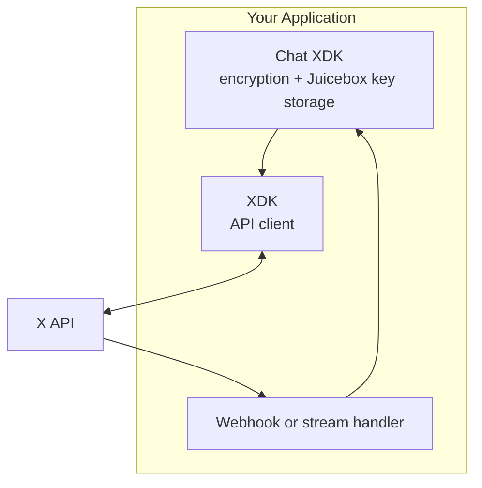

import { Button } from '/snippets/button.mdx';

This guide walks you through building a Chat application that can send and receive end-to-end encrypted direct messages. By the end, you'll have a working application that can:

- Generate, register, and securely store encryption keys
- Initialize a conversation and send an encrypted message
- Receive and decrypt incoming messages in real time

<Note>
**Prerequisites**

Before you begin, you'll need:
- An approved [developer account](https://developer.x.com/en/portal/petition/essential/basic-info)
- A [Project and App](/resources/fundamentals/developer-apps) in the Developer Console
- OAuth 2.0 credentials with the `dm.read`, `dm.write`, `tweet.read`, `users.read`, and `media.write` scopes
- Python 3.10+ or Node.js 18+
</Note>

---

## How the pieces fit together

Your Chat application combines two SDKs: the **Chat XDK** for cryptography and key storage, and the **XDK** for calling the X API.



| Component | Purpose |
|:----------|:--------|
| **Chat XDK** (`chat-xdk`) | Generates keys, encrypts/decrypts/signs messages, and stores private keys via integrated Juicebox |
| **XDK** (`xdk` / `@xdevplatform/xdk`) | Calls `/2/chat/*` and `/2/users/*/public_keys` via `client.chat.*` |
| **Webhook / stream handler** | Receives real-time chat events from the X Activity API |

Create the XDK client once with your OAuth 2.0 user token:

<Tabs>
  <Tab title="Python">
    ```python
    from xdk import Client

    client = Client(access_token="YOUR_OAUTH2_USER_TOKEN")
    ```
  </Tab>
  <Tab title="TypeScript">
    ```typescript
    import { Client } from '@xdevplatform/xdk';

    const client = new Client({ accessToken: 'YOUR_OAUTH2_USER_TOKEN' });
    ```
  </Tab>
</Tabs>

<Note>
**XDK version.** The chat client methods used below — `client.chat.send_message`, `client.chat.add_user_public_key`, and `client.chat.get_user_public_keys` — are available today. The newest endpoints, initializing conversation keys (`POST /2/chat/conversations/{id}/keys`) and listing conversation events (`GET /2/chat/conversations/{id}/events`), map to `client.chat.initialize_conversation_keys(...)` and `client.chat.get_conversation_events(...)` (camelCase in TypeScript). If your installed XDK predates those endpoints, upgrade it or call the documented paths directly.
</Note>

---

## Step 1: Install dependencies

<Tabs>
  <Tab title="Python">
    ```bash
    # Chat XDK (encryption) + the XDK (API client)
    pip install chat-xdk xdk
    ```
  </Tab>
  <Tab title="TypeScript">
    ```bash
    # Chat XDK (encryption) + the XDK (API client)
    npm install chat-xdk @xdevplatform/xdk
    ```
  </Tab>
</Tabs>

---

## Step 2: Fetch your Juicebox config and initialize the Chat XDK

The Chat XDK stores your private keys with [Juicebox](/xchat/cryptography-primer#juicebox-distributed-key-storage). Request your own public-key record with the `juicebox_config` field, then hand that config to the Chat XDK.

<Tabs>
  <Tab title="Python">
    ```python
    import json
    from chat_xdk import Chat

    resp = client.chat.get_user_public_keys(
        "YOUR_USER_ID",
        public_key_fields=[
            "version", "public_key", "signing_public_key",
            "identity_public_key_signature", "juicebox_config",
        ],
    )
    record = resp.data[0]
    signing_key_version = record["version"]

    # The Chat XDK accepts the API's juicebox_config object directly.
    chat = Chat(json.dumps(record["juicebox_config"]))
    ```
  </Tab>
  <Tab title="TypeScript">
    ```typescript
    import { createChat } from 'chat-xdk';

    const resp = await client.chat.getUserPublicKeys('YOUR_USER_ID', {
      publicKeyFields: [
        'version', 'public_key', 'signing_public_key',
        'identity_public_key_signature', 'juicebox_config',
      ],
    });
    const record = resp.data[0];
    const signingKeyVersion = record.version;

    const chat = await createChat({
      juiceboxConfig: JSON.stringify(record.juicebox_config),
      getAuthToken: async (realmId) => getTokenForRealm(realmId),
    });
    ```
  </Tab>
</Tabs>

<Note>
If you'd rather manage keys yourself instead of using Juicebox, create the SDK with no config (`Chat()` in Python, `createChatWithoutJuicebox()` in TypeScript) and use `export_keys()` / `import_keys()` to persist the raw key bytes. The rest of this guide uses Juicebox.
</Note>

---

## Step 3: Generate and register encryption keys

The first time a user onboards, generate their identity and signing keypairs, register the **public** keys with X, then store the private keys in Juicebox under a PIN.

<Tabs>
  <Tab title="Python">
    ```python
    from xdk.chat.models import AddUserPublicKeyRequest

    def setup_encryption_keys(user_id: str, pin: str):
        # Generate identity + signing keypairs (held in memory).
        registration = chat.generate_keypairs()
        pk = registration.public_key

        # Register the PUBLIC keys with X.
        client.chat.add_user_public_key(
            user_id,
            AddUserPublicKeyRequest(
                public_key={
                    "identity_public_key_signature": pk.identity_public_key_signature,
                    "public_key": pk.public_key,
                    "public_key_fingerprint": pk.public_key_fingerprint,
                    "registration_method": pk.registration_method,
                    "signing_public_key": pk.signing_public_key,
                    "signing_public_key_signature": pk.signing_public_key_signature,
                },
                version=registration.version,
                generate_version=registration.generate_version,
            ),
        )

        # Store the PRIVATE keys in Juicebox, protected by the PIN.
        public_keys = chat.setup(pin)
        print(f"Keys stored. Fingerprint: {chat.get_public_key_fingerprint()}")
        return public_keys

    setup_encryption_keys("YOUR_USER_ID", "1234")  # Use a strong PIN in production!
    ```
  </Tab>
  <Tab title="TypeScript">
    ```typescript
    async function setupEncryptionKeys(userId: string, pin: string) {
      // Generate identity + signing keypairs (held in memory).
      const registration = chat.generateKeypairs();
      const pk = registration.publicKey;

      // Register the PUBLIC keys with X (map the SDK's camelCase to the API body).
      await client.chat.addUserPublicKey(userId, {
        public_key: {
          identity_public_key_signature: pk.identityPublicKeySignature,
          public_key: pk.publicKey,
          public_key_fingerprint: pk.publicKeyFingerprint,
          registration_method: pk.registrationMethod,
          signing_public_key: pk.signingPublicKey,
          signing_public_key_signature: pk.signingPublicKeySignature,
        },
        version: registration.version,
        generate_version: registration.generateVersion,
      });

      // Store the PRIVATE keys in Juicebox, protected by the PIN.
      const publicKeys = await chat.setup(pin);
      console.log('Keys stored. Fingerprint:', chat.getPublicKeyFingerprint());
      return publicKeys;
    }

    await setupEncryptionKeys('YOUR_USER_ID', '1234'); // Use a strong PIN in production!
    ```
  </Tab>
</Tabs>

<Warning>
**Key storage is critical.** After `setup()`, your private keys live in Juicebox and are recovered with your PIN. If you lose the PIN and can't recover your keys, you won't be able to decrypt past or future messages. Juicebox rate-limits wrong PINs and permanently locks the keys after too many failures.
</Warning>

---

## Step 4: Unlock keys on startup

After the one-time setup, unlock the keys from Juicebox each time your app starts.

<Tabs>
  <Tab title="Python">
    ```python
    def unlock_keys(pin: str):
        chat.unlock(pin)
        print(f"Unlocked: {chat.is_unlocked()}")
        print(f"Fingerprint: {chat.get_public_key_fingerprint()}")

    unlock_keys("1234")
    ```
  </Tab>
  <Tab title="TypeScript">
    ```typescript
    async function unlockKeys(pin: string) {
      await chat.unlock(pin);
      console.log('Unlocked:', chat.isUnlocked());
      console.log('Fingerprint:', chat.getPublicKeyFingerprint());
    }

    await unlockKeys('1234');
    ```
  </Tab>
</Tabs>

---

## Step 5: Initialize conversation keys

Before the first message in a **new 1:1 conversation**, generate a conversation key, encrypt it for every participant, and register it with X. The Chat XDK's `prepare_conversation_keys` does the crypto in one call — feed it the participants' identity public keys (yours and the recipient's).

<Tabs>
  <Tab title="Python">
    ```python
    def get_public_key_input(user_id: str) -> dict:
        resp = client.chat.get_user_public_keys(
            user_id, public_key_fields=["version", "public_key"]
        )
        r = resp.data[0]
        # prepare_conversation_keys wants user_id, identity public_key, key_version.
        return {"user_id": user_id, "public_key": r["public_key"], "key_version": r["version"]}

    def initialize_conversation(my_user_id: str, recipient_id: str):
        public_keys = [get_public_key_input(my_user_id), get_public_key_input(recipient_id)]
        prepared = chat.prepare_conversation_keys(public_keys)

        # Map the SDK's participant keys to the API's field names.
        # SDK "encrypted_key" -> API "encrypted_conversation_key".
        participant_keys = [
            {
                "user_id": pk["user_id"],
                "encrypted_conversation_key": pk["encrypted_key"],
                "public_key_version": pk["public_key_version"],
            }
            for pk in prepared["participant_keys"]
        ]

        # Register the keys. For 1:1, the {id} can be the recipient's user ID.
        client.chat.initialize_conversation_keys(
            recipient_id,
            {
                "conversation_key_version": prepared["conversation_key_version"],
                "conversation_participant_keys": participant_keys,
            },
        )

        # Keep the raw conversation key + version locally — you'll use them to encrypt.
        return prepared["conversation_key"], prepared["conversation_key_version"]

    conv_key, conv_key_version = initialize_conversation("YOUR_USER_ID", "RECIPIENT_USER_ID")
    ```
  </Tab>
  <Tab title="TypeScript">
    ```typescript
    async function getPublicKeyInput(userId: string) {
      const resp = await client.chat.getUserPublicKeys(userId, {
        publicKeyFields: ['version', 'public_key'],
      });
      const r = resp.data[0];
      return { userId, publicKey: r.public_key, keyVersion: r.version };
    }

    async function initializeConversation(myUserId: string, recipientId: string) {
      const publicKeys = [await getPublicKeyInput(myUserId), await getPublicKeyInput(recipientId)];
      const prepared = chat.prepareConversationKeys(publicKeys);

      // Map the SDK's participant keys to the API's field names.
      const participantKeys = prepared.participantKeys.map((pk) => ({
        user_id: pk.userId,
        encrypted_conversation_key: pk.encryptedKey,
        public_key_version: pk.publicKeyVersion,
      }));

      await client.chat.initializeConversationKeys(recipientId, {
        conversation_key_version: prepared.conversationKeyVersion,
        conversation_participant_keys: participantKeys,
      });

      return { conversationKey: prepared.conversationKey, version: prepared.conversationKeyVersion };
    }
    ```
  </Tab>
</Tabs>

<Note>
If the conversation already exists, skip this step. Fetch the current conversation key from `client.chat.get_conversation_events(...)` (`meta.conversation_key_events`) and decrypt it with the Chat XDK instead — see [Step 7](#step-7-receive-messages-in-real-time).
</Note>

---

## Step 6: Send an encrypted message

`encrypt_message` takes the **raw** conversation key bytes (from Step 5 or from a decrypted key event), the current `conversation_key_version`, and your `signing_key_version` (the `version` of your registered public key). It returns a `SendPayload` whose fields map to the send-message request body.

<Tabs>
  <Tab title="Python">
    ```python
    import uuid
    from xdk.chat.models import SendMessageRequest

    def send_message(recipient_id, conversation_id, conv_key, conv_key_version, signing_key_version, text):
        message_id = str(uuid.uuid4())

        payload = chat.encrypt_message(
            message_id,            # unique id you generate
            "YOUR_USER_ID",        # sender_id
            conversation_id,       # conversation_id
            conv_key,              # RAW conversation key bytes
            text,
            conv_key_version,      # conversation_key_version
            signing_key_version,   # your registered signing key version
        )

        # Map SendPayload fields to the request body. For 1:1, {id} can be the recipient user ID.
        client.chat.send_message(
            recipient_id,
            SendMessageRequest(
                message_id=message_id,
                encoded_message_create_event=payload.encrypted_content,
                encoded_message_event_signature=payload.encoded_event_signature,
            ),
        )
        print(f"Sent message {message_id}")

    send_message(
        "RECIPIENT_USER_ID", "CONVERSATION_ID",
        conv_key, conv_key_version, "YOUR_SIGNING_KEY_VERSION",
        "Hello! This is an encrypted message.",
    )
    ```
  </Tab>
  <Tab title="TypeScript">
    ```typescript
    import { randomUUID } from 'crypto';

    async function sendMessage(recipientId, conversationId, convKey, convKeyVersion, signingKeyVersion, text) {
      const messageId = randomUUID();

      const payload = chat.encryptMessage(
        messageId,            // unique id you generate
        'YOUR_USER_ID',       // senderId
        conversationId,       // conversationId
        convKey,              // RAW conversation key (Uint8Array)
        text,
        convKeyVersion,       // conversationKeyVersion
        signingKeyVersion,    // your registered signing key version
      );

      // Map SendPayload fields to the request body.
      await client.chat.sendMessage(recipientId, {
        message_id: messageId,
        encoded_message_create_event: payload.encryptedContent,
        encoded_message_event_signature: payload.encodedEventSignature,
      });
      console.log(`Sent message ${messageId}`);
    }
    ```
  </Tab>
</Tabs>

<Warning>
The `SendPayload` field names don't match the request body. Map them explicitly:

| `SendPayload` field | Request body field |
|:--------------------|:-------------------|
| `encrypted_content` | `encoded_message_create_event` |
| `encoded_event_signature` | `encoded_message_event_signature` |
| (the `message_id` you generated) | `message_id` |
</Warning>

---

## Step 7: Receive messages in real time

To receive messages, set up a webhook (or open the activity stream) and subscribe to chat events. Each delivered event carries the encrypted message in `payload.encoded_event` plus, when needed, the conversation key change event in `payload.conversation_key_change_event`.

### 7.1 Subscribe to chat events

```bash
# Subscribe to messages received by your user
curl -X POST "https://api.x.com/2/activity/subscriptions" \
  -H "Authorization: Bearer YOUR_BEARER_TOKEN" \
  -H "Content-Type: application/json" \
  -d '{"event_type": "chat.received", "filter": {"user_id": "YOUR_USER_ID"}}'
```

The same call in the XDK is `client.activity.create_subscription(...)`. See [Real-time events](/xchat/real-time-events) for webhook registration, CRC validation, and signature verification.

### 7.2 Decrypt an incoming event

A delivered chat event looks like this (the `data` envelope is the same for webhooks and the stream):

```json
{
  "data": {
    "event_type": "chat.received",
    "event_uuid": "abc123",
    "payload": {
      "conversation_id": "1215441834412953600-1603419180975409153",
      "sender_id": "1603419180975409153",
      "id": "2046813948905676800",
      "encoded_event": "CwABAAAA...",
      "conversation_key_version": "1765441245499",
      "conversation_key_change_event": "CwABAAAA..."
    }
  }
}
```

Extract the conversation key from `conversation_key_change_event` (when present), then decrypt `encoded_event`. Pass the sender's signing keys so the SDK can verify the signature.

<Tabs>
  <Tab title="Python">
    ```python
    # Cache raw conversation keys per conversation: { conversation_id: { version: key_bytes } }
    conversation_keys = {}

    def get_signing_keys(user_id: str) -> list[dict]:
        resp = client.chat.get_user_public_keys(
            user_id,
            public_key_fields=["version", "public_key", "signing_public_key", "identity_public_key_signature"],
        )
        # Each record maps directly to a SigningKeyEntry.
        return [
            {
                "user_id": user_id,
                "public_key_version": r["version"],
                "public_key": r["signing_public_key"],
                "identity_public_key": r["public_key"],
                "identity_public_key_signature": r["identity_public_key_signature"],
            }
            for r in resp.data
        ]

    def handle_chat_event(event):
        payload = event.get("data", {}).get("payload", {})
        conversation_id = payload.get("conversation_id")
        encoded_event = payload.get("encoded_event")
        sender_id = payload.get("sender_id")

        # 1. Update cached keys from the key change event, if one is attached.
        key_change = payload.get("conversation_key_change_event")
        if key_change:
            extracted = chat.extract_conversation_keys([key_change])
            conversation_keys[conversation_id] = extracted["keys"]

        # 2. Decrypt the event with the cached keys, verifying the sender's signature.
        keys = conversation_keys.get(conversation_id, {})
        decrypted = chat.decrypt_event(encoded_event, keys, get_signing_keys(sender_id))

        if decrypted["type"] == "Message":
            content = decrypted["content"]
            if content.get("content_type") == "Text":
                print(f"Message from {decrypted['sender_id']}: {content['text']}")
                print(f"Signature verified: {decrypted['verified']}")
    ```
  </Tab>
  <Tab title="TypeScript">
    ```typescript
    // Cache raw conversation keys per conversation.
    const conversationKeys = new Map<string, ConversationKeyMap>();

    async function getSigningKeys(userId: string) {
      const resp = await client.chat.getUserPublicKeys(userId, {
        publicKeyFields: ['version', 'public_key', 'signing_public_key', 'identity_public_key_signature'],
      });
      return resp.data.map((r: any) => ({
        userId,
        publicKeyVersion: r.version,
        publicKey: r.signing_public_key,
        identityPublicKey: r.public_key,
        identityPublicKeySignature: r.identity_public_key_signature,
      }));
    }

    async function handleChatEvent(event: any) {
      const payload = event?.data?.payload ?? {};
      const { conversation_id: conversationId, encoded_event: encodedEvent, sender_id: senderId } = payload;

      // 1. Update cached keys from the key change event, if attached.
      if (payload.conversation_key_change_event) {
        const extracted = chat.extractConversationKeys([payload.conversation_key_change_event]);
        conversationKeys.set(conversationId, extracted.keys);
      }

      // 2. Decrypt with the cached keys, verifying the sender's signature.
      const keys = conversationKeys.get(conversationId) ?? {};
      const decrypted = chat.decryptEvent(encodedEvent, keys, await getSigningKeys(senderId));

      if (decrypted.type === 'message' && decrypted.content?.contentType === 'text') {
        console.log(`Message from ${decrypted.senderId}: ${decrypted.content.text}`);
        console.log('Signature verified:', decrypted.verified);
      }
    }
    ```
  </Tab>
</Tabs>

### 7.3 Loading history

To backfill a conversation, page `client.chat.get_conversation_events(...)` (`GET /2/chat/conversations/{id}/events`). The response gives you the raw events in `data[].encoded_event` and every key change event in `meta.conversation_key_events`. The batch `decrypt_events` extracts keys and decrypts everything in one call:

<Tabs>
  <Tab title="Python">
    ```python
    signing_keys = []  # collect signing keys for all participants
    for participant_id in participant_ids:
        signing_keys += get_signing_keys(participant_id)

    raw_events, key_events = [], []
    for page in client.chat.get_conversation_events(conversation_id):
        raw_events += [e["encoded_event"] for e in (page.data or [])]
        key_events += (page.meta.conversation_key_events or []) if page.meta else []

    result = chat.decrypt_events(raw_events + key_events, signing_keys)
    for dm in result["messages"]:
        evt = dm["event"]
        if evt["type"] == "Message" and evt["content"].get("content_type") == "Text":
            print(evt["sender_id"], evt["content"]["text"])

    # Cache the extracted keys for sending replies / decrypting new events.
    conversation_keys[conversation_id] = result["conversation_keys"]["keys"]
    ```
  </Tab>
  <Tab title="TypeScript">
    ```typescript
    const signingKeys = (await Promise.all(participantIds.map(getSigningKeys))).flat();

    const rawEvents: string[] = [];
    const keyEvents: string[] = [];
    for await (const page of client.chat.getConversationEvents(conversationId)) {
      rawEvents.push(...(page.data ?? []).map((e: any) => e.encoded_event));
      keyEvents.push(...(page.meta?.conversation_key_events ?? []));
    }

    const result = chat.decryptEvents([...rawEvents, ...keyEvents], signingKeys);
    for (const dm of result.messages) {
      if (dm.event.type === 'message' && dm.event.content?.contentType === 'text') {
        console.log(dm.event.senderId, dm.event.content.text);
      }
    }

    conversationKeys.set(conversationId, result.conversationKeys.keys);
    ```
  </Tab>
</Tabs>

---

## Step 8: Handle key changes

Conversation keys rotate when membership changes (someone joins or leaves a group). When that happens you receive a `conversation_key_change_event` (on chat events) or a decrypted event of type `KeyChange`. Re-extract the keys and update your cache — the latest version is what you use to send new messages.

<Tabs>
  <Tab title="Python">
    ```python
    def update_keys_from_key_change(conversation_id: str, key_change_event_b64: str):
        extracted = chat.extract_conversation_keys([key_change_event_b64])
        # extracted = { "keys": { version: key_bytes }, "latest_version": "..." }
        conversation_keys.setdefault(conversation_id, {}).update(extracted["keys"])
        return extracted["latest_version"]  # use this version to encrypt new messages
    ```
  </Tab>
  <Tab title="TypeScript">
    ```typescript
    function updateKeysFromKeyChange(conversationId: string, keyChangeEventB64: string) {
      const extracted = chat.extractConversationKeys([keyChangeEventB64]);
      const existing = conversationKeys.get(conversationId) ?? {};
      conversationKeys.set(conversationId, { ...existing, ...extracted.keys });
      return extracted.latestVersion; // use this version to encrypt new messages
    }
    ```
  </Tab>
</Tabs>

---

## Complete example: an echo bot

This Python bot opens the activity stream, decrypts each incoming message, and replies with `received <text>`. It mirrors the `xchat-bot-python` sample.

```python
import uuid
from xdk import Client
from xdk.chat.models import SendMessageRequest
from chat_xdk import Chat

USER_ID = "YOUR_USER_ID"
SIGNING_KEY_VERSION = "YOUR_SIGNING_KEY_VERSION"

# OAuth2 user token for sending; app bearer token for the stream.
client = Client(access_token="YOUR_OAUTH2_USER_TOKEN")
stream_client = Client(bearer_token="YOUR_BEARER_TOKEN")

# Unlock the Chat XDK at startup (juicebox_config fetched in Step 2).
chat = Chat(JUICEBOX_CONFIG_JSON)
chat.unlock("1234")

# Cache raw conversation keys: { conversation_id: { version: key_bytes } }
conversation_keys = {}

def get_signing_keys(user_id):
    resp = client.chat.get_user_public_keys(
        user_id,
        public_key_fields=["version", "public_key", "signing_public_key", "identity_public_key_signature"],
    )
    return [
        {
            "user_id": user_id,
            "public_key_version": r["version"],
            "public_key": r["signing_public_key"],
            "identity_public_key": r["public_key"],
            "identity_public_key_signature": r["identity_public_key_signature"],
        }
        for r in resp.data
    ]

def handle_event(response):
    data = response.data
    if not data or data.event_type != "chat.received":
        return
    payload = data.payload or {}

    conversation_id = payload.get("conversation_id")
    sender_id = payload.get("sender_id")
    encoded_event = payload.get("encoded_event")
    if sender_id == USER_ID:
        return  # skip our own messages

    # Refresh keys from the attached key change event, if any.
    key_change = payload.get("conversation_key_change_event")
    if key_change:
        conversation_keys[conversation_id] = chat.extract_conversation_keys([key_change])["keys"]

    keys = conversation_keys.get(conversation_id, {})
    decrypted = chat.decrypt_event(encoded_event, keys, get_signing_keys(sender_id))
    if decrypted.get("type") != "Message":
        return
    content = decrypted.get("content", {})
    if content.get("content_type") != "Text":
        return

    reply(conversation_id, payload.get("conversation_key_version"), f"received {content['text']}")

def reply(conversation_id, conv_key_version, text):
    # Use the latest raw conversation key for this conversation.
    keys = conversation_keys.get(conversation_id, {})
    raw_key = keys.get(conv_key_version) or next(iter(keys.values()), None)
    if raw_key is None:
        return

    message_id = str(uuid.uuid4())
    payload = chat.encrypt_message(
        message_id, USER_ID, conversation_id, raw_key, text,
        conv_key_version, SIGNING_KEY_VERSION,
    )
    client.chat.send_message(
        conversation_id,
        SendMessageRequest(
            message_id=message_id,
            encoded_message_create_event=payload.encrypted_content,
            encoded_message_event_signature=payload.encoded_event_signature,
        ),
    )

# Stream activity events and dispatch them.
for response in stream_client.activity.stream():
    handle_event(response)
```

---

## Best practices

### Security

- **Use a strong PIN** for Juicebox key storage.
- **Never log** raw keys or decrypted message content in production.
- **Verify signatures** by always passing the sender's signing keys to `decrypt_event` / `decrypt_events`, and consider `set_reject_unverified(True)`.
- **Refresh OAuth tokens** before they expire (the XDK refreshes automatically when constructed with `client_id` and a `token` dict).

### Performance

- **Cache conversation keys** in memory (and persist them). Decrypting a conversation key with ECIES is expensive; the raw key is reusable across messages of the same version.
- **Cache public/signing keys** per user and refresh on `SignatureVerificationFailed`.
- **Use webhooks or the stream** instead of polling for real-time apps.

### Reliability

- **Deduplicate** events using `event_uuid` (X may retry delivery).
- **Handle key rotation** by re-extracting keys whenever a `conversation_key_change_event` arrives.
- **Retry transient errors** with exponential backoff.

---

## Next steps

<CardGroup cols={2}>
  <Card title="Chat XDK Reference" icon="code" href="/xchat/xchat-xdk">
    Full API reference for the encryption SDK
  </Card>
  <Card title="Troubleshooting" icon="wrench" href="/xchat/troubleshooting">
    Common errors and solutions
  </Card>
  <Card title="Real-time Events" icon="bolt" href="/xchat/real-time-events">
    Activity API and webhook setup
  </Card>
  <Card title="Chat API Reference" icon="message" href="/x-api/chat/get-chat-conversations">
    Full chat endpoint documentation
  </Card>
</CardGroup>
