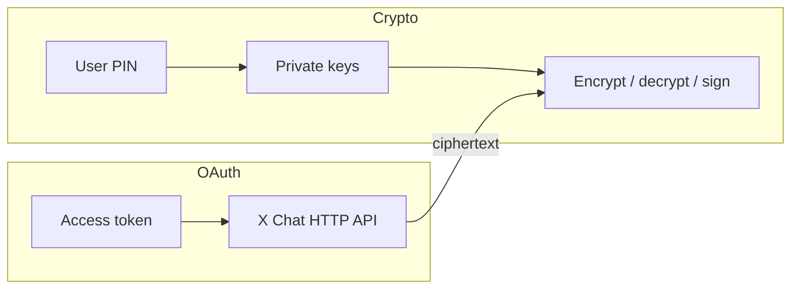

X Chat identity and signing **private keys** are the root of a user's encrypted messaging identity. Anyone who holds them can unwrap conversation keys delivered to that identity and sign as that user for chat. Treat the encryption **PIN / passcode** the same way: it recovers those keys from secure key backup.

This page covers rules for every app type. For the recommended client architecture, see [Building UI apps with WASM](/xchat/building-ui-apps-with-wasm).

---

## Critical warning for users and app builders

<Warning>
**Never ask end users to share their encryption PIN or private keys with a third-party server, support agent, or “helper” app.**

The PIN unlocks **root identity keys**. A party that obtains the PIN (or the private key blob) can:

- Decrypt conversation keys wrapped to that identity (and therefore message history they can obtain as ciphertext)
- Continue to send and receive as that cryptographic identity
- Keep that ability **even if the user later revokes OAuth** for the app

Revoking OAuth stops API access for that app's tokens. It does **not** invalidate private keys the user already gave away. Prefer architectures where the PIN is entered only into **on-device** crypto ([WASM in the browser](/xchat/building-ui-apps-with-wasm) or a native client using the Chat XDK).
</Warning>

### Product and docs copy you should show

If your app requests DM-related OAuth scopes (`dm.read`, `dm.write`, and related scopes), pair the OAuth consent screen with clear product language:

- Encryption keys stay on the user's device when you use the official client SDK path.
- Users should never type their X Chat PIN into a website that forwards it to a backend.
- Legitimate integrations use the [Chat XDK](/xchat/xchat-xdk) so PIN-backed recovery and crypto run locally (for browsers: WASM + secure key backup).
- A malicious app that obtains private keys can exfiltrate them; there is no server-side “revoke this key” for a pure client-held root key today—design so users never need to hand root keys to you.

---

## What counts as sensitive key material

| Material | Sensitivity | Notes |
|:---------|:------------|:------|
| **Encryption PIN / passcode** | Critical | Recovers private keys from [secure key backup](/xchat/cryptography-primer#secure-key-backup-distributed-key-storage) |
| **Identity private key** | Critical | Unwraps conversation keys for this user |
| **Signing private key** | Critical | Proves authorship of messages and state changes |
| **`export_keys` blob** | Critical | Opaque full private-key state from the Chat XDK; treat like a password file |
| **Unwrapped conversation keys** | High | Decrypt messages in one conversation (versioned; still sensitive) |
| **OAuth access / refresh tokens** | High | API access only—not a substitute for chat private keys, and not revoked by deleting keys |
| **Juicebox realm auth tokens** | Medium | Authorize backup protocol for a user/key version; not the PIN |
| **Public keys** | Public | Safe to fetch and store |

---

## Choose the right key path by app type

| App type | Recommended key path | Do not |
|:---------|:---------------------|:-------|
| **User-facing web UI** | Browser [WASM Chat XDK](/xchat/building-ui-apps-with-wasm) + `setup` / `unlock` (secure key backup) | Send PIN or private keys to your servers; store raw key blobs in `localStorage` |
| **Native mobile / desktop client** | Chat XDK on device + secure key backup or OS keystore-backed blob | Sync unencrypted key blobs to your cloud |
| **Bot / automation on your infrastructure** | `export_keys` blob in a **secret manager** or HSM; load with `import_keys` | Commit blobs to git; log them; embed in client-side JS |
| **Server that only moves ciphertext** | No private keys at all—proxy encrypted payloads | Decrypt “for convenience” on the server for UI users |

Client apps should prefer **secure key backup**. Servers and bots often use an exported key blob. Details: [Getting Started](/xchat/getting-started#2-initialize-the-chat-xdk-with-existing-keys).

---

## Rules for private keys and PINs

### Do

- **Collect the PIN only in trusted client UI** that feeds the Chat XDK (`unlock` / `setup`) on the same device.
- **Keep keys in memory only while needed.** After unlock, reuse the same Chat instance for the session; call `lock()` or `free()` on logout.
- **Zeroize PIN buffers when the API allows** (for example pass a `Uint8Array` PIN in JS so you can clear it after `unlock`).
- **Store bot key blobs in a secret manager** (or HSM), encrypt at rest, restrict IAM, rotate process credentials often.
- **Log carefully:** never log PINs, private keys, key blobs, unwrapped conversation keys, or full secure-backup responses.
- **Defend the client:** XSS, malicious extensions, and compromised dependencies can read in-memory keys even when the network path is clean.

### Do not

- **Do not** email, screenshot, or ticket a PIN or key blob.
- **Do not** put private keys or PINs in query strings, analytics, error trackers, or CDN logs.
- **Do not** ship end-user private keys to “make the backend simpler.”
- **Do not** confuse **OAuth revoke** with **key revoke**. Disconnecting an app does not erase keys a user already exported or typed into a hostile client.
- **Do not** store raw `export_keys` output in `localStorage` or unencrypted IndexedDB for production UI apps.

---

## Browser session persistence

Production browser apps should optimize for **security first**, then UX:

| Strategy | Security | UX | Recommendation |
|:---------|:---------|:---|:---------------|
| **Unlock once per page load; hold Chat in memory** | Strong | PIN after every full reload; no PIN per message | **Default recommendation** |
| **Re-prompt PIN on every message** | Strong but noisy | Poor | Avoid (demo-only anti-pattern) |
| **Plaintext or base64 key blob in `localStorage`** | Weak (any XSS or shared device reads keys) | Convenient | **Do not use in production** |
| **PIN-gated secure key backup only** (Juicebox) | Strong; guess-limited recovery | PIN on new device / reload | **Preferred durable storage** |

Internal demos sometimes export keys to `localStorage` for convenience. That is fine for throwaway prototypes; it is **not** a production pattern. Prefer:

1. `createChat` + `unlock(pin)` after reload.
2. Module-level or framework context holding the unlocked instance for SPA navigation.
3. `lock()` when the tab logs out or the user locks the app.

If you add extra “stay unlocked on this device” behavior, wrap any persisted material with **Web Crypto** (non-extractable keys where possible), bind it to the user session, and still never upload that material to your servers. The durable recovery path remains the user's PIN and secure key backup—not a second copy of the root key on your infrastructure.

---

## OAuth scopes vs encryption keys

These are separate control planes:

- **OAuth** authorizes API calls (list conversations, post ciphertext, fetch events).
- **Private keys** authorize cryptographic access to message contents.

A complete product should:

1. Request only the DM scopes it needs.
2. Explain why DM access is required.
3. Run crypto **on device** so OAuth never becomes a channel for collecting PINs.
4. Stop holding tokens on logout; separately `lock()` chat keys.

---

## Operational checklist

- [ ] No PIN or private key fields on server request bodies for UI flows  
- [ ] Secure key backup (`setup` / `unlock`) for clients; secret manager for bot blobs  
- [ ] Unlocked Chat instance scoped to one user session; cleared on logout  
- [ ] Logging and APM scrubbed of secrets  
- [ ] CSP and XSS controls on any page that can unlock chat  
- [ ] User-facing copy: never share PIN with third parties  
- [ ] Incident plan: if a bot blob leaks, rotate keys / re-register and treat historical ciphertext as exposed to the holder of the old key  

---

## Related reading

- [Building UI apps with WASM](/xchat/building-ui-apps-with-wasm) — client architecture  
- [Cryptography primer](/xchat/cryptography-primer) — identity keys, conversation keys, secure key backup  
- [Getting Started](/xchat/getting-started) — register keys and send a message  
- [Chat XDK](/xchat/xchat-xdk) — API reference  
- [Fundamentals: Security](/fundamentals/security) — OAuth and API credential hygiene  
