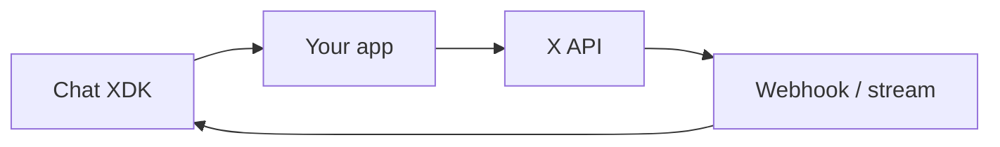

The **Chat API** lets you send and receive **end-to-end encrypted** direct messages on X. Message bodies are encrypted on the client; X routes ciphertext and cannot read plaintext content. Messages are also **signed** so recipients can verify the sender.

---

## What you need in your app

| Piece | Responsibility |
|:------|:---------------|
| **[Chat XDK](/xchat/xchat-xdk)** | Generate keys, encrypt/decrypt, sign/verify, optional Juicebox PIN storage (Python, JS, Rust, Go, C#, Java) |
| **X API access** | Public keys, conversation keys, messages, events, media—via **[XDK](/xdks/python/overview)** (Python/TypeScript) or HTTPS |
| **Delivery** | [Webhooks or activity stream](/xchat/real-time-events) for live events; events API for history |

Follow **[Getting Started](/xchat/getting-started)** for a full implementation. For concepts only, see the **[Cryptography primer](/xchat/cryptography-primer)**.

---

## How encryption works (overview)

1. Create **identity** and **signing** keypairs; store private keys securely (Juicebox or protected blob).  
2. **Publish public keys** so others can wrap conversation keys to you and verify signatures.  
3. Share a **conversation key** by posting encrypted copies for each participant.  
4. **Encrypt and sign** outbound messages; send only ciphertext to X.  
5. **Receive** ciphertext via webhooks, stream, or event history.  
6. **Verify and decrypt** with the Chat XDK.

---

## Useful endpoints

Grouped under **API reference** in the sidebar, including:

- Public keys — register and fetch  
- Conversations and messages — list/get threads, init keys, events, send, typing, read, group membership  
- Media — upload and download encrypted attachments ([guide](/xchat/media))

---

## Auth notes

Use **OAuth 2.0 user context** with DM-related scopes (`dm.read`, `dm.write`, plus `users.read` / `tweet.read` as required; `media.write` for uploads). Chat activity for a user requires that user’s authorization. Juicebox config for PIN storage is returned on **your** public-key record (`juicebox_config` field)—see Getting Started.

---

## Next steps

1. [Cryptography primer](/xchat/cryptography-primer) — optional background on E2EE concepts  
2. [Getting Started](/xchat/getting-started) — implement keys, send, and receive  
3. [Chat XDK](/xchat/xchat-xdk) — encryption SDK reference  
4. [Real-time events](/xchat/real-time-events), [Media](/xchat/media), or [Troubleshooting](/xchat/troubleshooting) when you need those topics  
