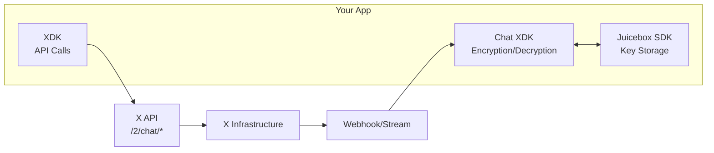

import { Button } from '/snippets/button.mdx';

The Chat API enables developers to build applications that send and receive **end-to-end encrypted direct messages** on X. Unlike standard DMs, Chat messages are encrypted on the sender's device and can only be decrypted by the intended recipient — not even X can read the message contents.

<CardGroup cols={2}>
  <Card title="End-to-end encrypted" icon="lock">
    Messages are encrypted on sender's device and only readable by recipients
  </Card>
  <Card title="Cryptographically signed" icon="signature">
    Every message is digitally signed to verify authenticity
  </Card>
  <Card title="Real-time events" icon="bolt">
    Receive chat events via webhooks or persistent streams
  </Card>
  <Card title="Multi-platform SDKs" icon="cube">
    Python, TypeScript, and Rust SDKs for encryption operations
  </Card>
</CardGroup>

---

## What you can build

Chat enables a wide range of secure messaging applications:

| Use Case | Description |
|:---------|:------------|
| **Customer Service Bots** | Build AI-powered assistants that handle customer inquiries securely |
| **Notification Systems** | Send encrypted transactional messages (order updates, alerts, etc.) |
| **CRM Integrations** | Connect X messaging with your customer relationship tools |
| **Support Ticketing** | Create secure support channels with encrypted conversation history |
| **Automated Responses** | Set up auto-replies and smart routing while maintaining E2EE |

---

## Architecture overview

Building with Chat involves three main components working together:

| Component | Purpose | SDK |
|:----------|:--------|:----|
| **Chat XDK** | Handles all cryptographic operations — encryption, decryption, signing, verification | Rust, Python, JavaScript/WASM |
| **Juicebox SDK** | Secure PIN-protected storage for encryption keys across distributed servers | Rust, Swift, Android, JavaScript |
| **XDK (Python/TypeScript)** | Makes API calls to X's `/2/chat/*` endpoints | Python, TypeScript |

---

## How Chat encryption works

<Steps>
  <Step title="Generate encryption keys">
    Your app generates an identity keypair (for encrypting/decrypting conversation keys) and a signing keypair (for authenticating messages). These are stored securely via Juicebox.
  </Step>
  <Step title="Register public keys with X">
    You register your public keys with X's API so other users can encrypt messages to you.
  </Step>
  <Step title="Encrypt outgoing messages">
    When sending a message, the Chat XDK encrypts the content using the conversation key and signs it with your signing key.
  </Step>
  <Step title="Send via X API">
    Your app sends the encrypted payload to X using the `/2/chat/conversations/{id}/messages` endpoint.
  </Step>
  <Step title="Receive encrypted events">
    Incoming messages arrive via the X Activity API (webhooks or streams) or by polling the conversations endpoint.
  </Step>
  <Step title="Decrypt and verify">
    The Chat XDK decrypts the message using the conversation key and verifies the sender's signature.
  </Step>
</Steps>

---

## Key concepts

### End-to-end encryption (E2EE)

Chat uses **end-to-end encryption**, meaning messages are encrypted on your device before being sent to X's servers. Only the intended recipient(s) can decrypt the message — X cannot read the content.

### Conversation keys

Each conversation has a symmetric **conversation key** used to encrypt all messages in that conversation. This key is itself encrypted to each participant using their public identity key, so only authorized participants can decrypt messages.

### Digital signatures

Every message is **cryptographically signed** by the sender. This allows recipients to verify that:
- The message hasn't been tampered with
- The message actually came from the claimed sender

### Juicebox key storage

Private encryption keys are stored using **Juicebox**, a distributed PIN-protected key storage system. Your keys are split across multiple independent servers — no single party (including Juicebox operators) can access your keys without your PIN.

---

## Supported event types

The X Activity API supports real-time delivery of chat events:

| Event Type | Description |
|:-----------|:------------|
| `chat.received` | Fired when a user receives a direct message |
| `chat.sent` | Fired when a user sends a direct message |

These events deliver encrypted message payloads that you decrypt using the Chat XDK.

---

## API endpoints

Chat uses the `/2/chat/*` family of endpoints, plus public key endpoints under `/2/users/`:

| Method | Endpoint | Description |
|:-------|:---------|:------------|
| GET | [`/2/chat/conversations`](/x-api/chat/get-chat-conversations) | List conversations |
| GET | [`/2/chat/conversations/{id}`](/x-api/chat/get-chat-conversation) | Get conversation messages |
| POST | [`/2/chat/conversations/{id}/messages`](/x-api/chat/send-chat-message) | Send encrypted message |
| POST | [`/2/chat/conversations/{id}/read`](/x-api/chat/mark-conversation-as-read) | Mark as read |
| POST | [`/2/chat/conversations/{id}/typing`](/x-api/chat/send-typing-indicator) | Send typing indicator |
| GET | [`/2/users/{id}/public_keys`](/x-api/chat/get-user-public-keys) | Get user's public keys |
| POST | [`/2/users/{id}/public_keys`](/x-api/chat/add-public-key) | Register public keys |
| POST | [`/2/chat/media/upload/initialize`](/x-api/chat/initialize-chat-media-upload) | Initialize media upload |
| POST | [`/2/chat/media/upload/{id}/append`](/x-api/chat/append-chat-media-upload) | Append media data |
| POST | [`/2/chat/media/upload/{id}/finalize`](/x-api/chat/finalize-chat-media-upload) | Finalize media upload |
| GET | [`/2/chat/media/{conversation_id}/{media_hash_key}`](/x-api/chat/download-chat-media) | Download media |

---

## Authentication

Chat endpoints require **user context authentication**:

| Auth Method | Description |
|:------------|:------------|
| **OAuth 2.0 User Token** | Preferred method with specific scopes (`dm.read`, `dm.write`, `media.write`) |
| **OAuth 1.0a User Token** | Alternative authentication method |

The authenticated user is the "sender" for outgoing messages and the "recipient" for incoming events.

---

## SDKs and tools

<CardGroup cols={3}>
  <Card title="Chat XDK" icon="lock" href="/xchat/xchat-xdk">
    Cryptographic SDK for encryption, decryption, and signing
  </Card>
  <Card title="XDK (Python)" icon="python" href="/xdks/python/overview">
    Full-featured Python SDK with chat client
  </Card>
  <Card title="XDK (TypeScript)" icon="js" href="/xdks/typescript/overview">
    TypeScript/JavaScript SDK with chat client
  </Card>
</CardGroup>

---

## Next steps

<CardGroup cols={2}>
  <Card title="Cryptography Primer" icon="key" href="/xchat/cryptography-primer">
    Understand the encryption concepts behind Chat
  </Card>
  <Card title="Getting Started" icon="rocket" href="/xchat/getting-started">
    Build your first Chat application step-by-step
  </Card>
</CardGroup>

<Note>
**Prerequisites**

Before building with Chat, you'll need:
- An approved [developer account](https://developer.x.com/en/portal/petition/essential/basic-info)
- A [Project and App](/resources/fundamentals/developer-apps) in the Developer Console
- Juicebox configuration (contact your X account representative for access)
</Note>
