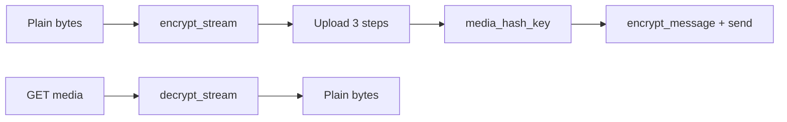

Images and other files use the **same conversation key** as text. Encrypt bytes with the Chat XDK (`encrypt_stream` / `decrypt_stream`), upload via **`/2/chat/media/...`** (sidebar **API reference → Media**), then attach **`media_hash_key`** on `encrypt_message`.

Include **`media.write`** with your DM scopes when uploading. Use hyphenated conversation ids in paths (`:` → `-`). Prefer MIME/dimensions from **decrypted** bytes.

This path is **not** the Posts media model (`expansions=attachments.media_keys`, `media.fields=variants`, etc.). Those parameters apply to **Posts**; E2EE X Chat blobs are addressed by **`media_hash_key`** and X Chat media download.



---

## Encrypt

<Tabs>
  <Tab title="Python">
    ```python
    from chat_xdk import detect_mime_type, detect_image_dimensions

    with open("photo.jpg", "rb") as f:
        plaintext = f.read()

    mime = detect_mime_type(plaintext)
    dims = detect_image_dimensions(plaintext)
    width, height = dims if dims else (0, 0)

    encrypted_blob = chat.encrypt_stream(plaintext, raw_conv_key)
    ```
  </Tab>
  <Tab title="TypeScript">
    ```typescript
    import { detectMimeType, detectImageDimensions } from '@xdevplatform/chat-xdk';
    import { readFile } from 'fs/promises';

    const plaintext = await readFile('photo.jpg');
    const mime = detectMimeType(plaintext);
    const dims = detectImageDimensions(plaintext);
    const width = dims?.width ?? 0;
    const height = dims?.height ?? 0;

    const encryptedBlob = chat.encryptStream(plaintext, rawConvKey);
    ```
  </Tab>
  <Tab title="Rust">
    ```rust
    use chat_xdk_core::{detect_image_dimensions, detect_mime_type};

    let plaintext = std::fs::read("photo.jpg")?;
    let _mime = detect_mime_type(&plaintext);
    let dims = detect_image_dimensions(&plaintext);
    let (width, height) = dims.map(|d| (d.width as i64, d.height as i64)).unwrap_or((0, 0));
    let encrypted_blob = chat.encrypt_stream(&plaintext, &raw_conv_key)?;
    ```
  </Tab>
  <Tab title="Go">
    ```go
    plaintext, err := os.ReadFile("photo.jpg")
    mime, _ := chatxdk.DetectMimeType(plaintext)
    dims, _ := chatxdk.DetectImageDimensions(plaintext)
    _ = mime
    ptB64, _ := chatxdk.BytesToBase64(plaintext)
    encryptedB64, err := chat.EncryptStream(ptB64, convKeyB64)
    _ = dims
    _ = encryptedB64
    ```
  </Tab>
  <Tab title="C#">
    ```csharp
    using ChatXdk;

    byte[] plaintext = await File.ReadAllBytesAsync("photo.jpg");
    string? mime = ChatXdkUtilities.DetectMimeType(plaintext);
    var dims = ChatXdkUtilities.DetectImageDimensions(plaintext);
    int width = dims?.Width ?? 0;
    int height = dims?.Height ?? 0;
    byte[] encryptedBlob = chat.EncryptStream(plaintext, rawConvKey);
    ```
  </Tab>
  <Tab title="Java">
    ```java
    import com.xdevplatform.chatxdk.ChatXdkUtilities;
    import com.xdevplatform.chatxdk.Types.ImageDimensions;

    byte[] plaintext = Files.readAllBytes(Path.of("photo.jpg"));
    String mime = ChatXdkUtilities.detectMimeType(plaintext);
    ImageDimensions dims = ChatXdkUtilities.detectImageDimensions(plaintext);
    int width = dims != null ? dims.width : 0;
    int height = dims != null ? dims.height : 0;
    byte[] encryptedBlob = chat.encryptStream(plaintext, rawConvKey);
    ```
  </Tab>
</Tabs>

`encrypt_stream` / `decrypt_stream` process the whole payload in memory. For large files, `stream_encryptor()` / `stream_decryptor()` return incremental objects (`StreamEncryptor` / `StreamDecryptor`): feed chunks with `push`, then call `finish` once—`finish` errors if the stream was truncated.

---

## Upload

| Step | Method | Path |
|:-----|:-------|:-----|
| Initialize | `POST` | `/2/chat/media/upload/initialize` |
| Append | `POST` | `/2/chat/media/upload/{id}/append` |
| Finalize | `POST` | `/2/chat/media/upload/{id}/finalize` |

Use the request bodies on the OpenAPI pages under **API reference → Media**. Prefer **encrypted** blob size where size is required. Finalize yields **`media_hash_key`** for attachments and download. Retry transient `5xx` with backoff. Python/TypeScript may use the XDK when media helpers exist; otherwise POST with a Bearer token in any language.

---

## Send with an attachment

Encrypt with a media attachment, then POST the send-message body (same field mapping as [Getting Started](/xchat/getting-started#5-send-a-message)).

<Tabs>
  <Tab title="Python">
    ```python
    import uuid
    from xdk.chat.models import SendMessageRequest

    message_id = str(uuid.uuid4())
    payload = chat.encrypt_message(
        message_id,
        sender_id,
        conversation_id,
        raw_conv_key,
        caption or "",
        conversation_key_version,
        signing_key_version,
        attachments=[{
            "attachment_type": "media",
            "media_hash_key": media_hash_key,
            "width": width,
            "height": height,
            "filesize_bytes": len(plaintext),
            "filename": "photo.jpg",
        }],
    )
    client.chat.send_message(
        conversation_id.replace(":", "-"),
        SendMessageRequest(
            message_id=message_id,
            encoded_message_create_event=payload.encrypted_content,
            encoded_message_event_signature=payload.encoded_event_signature,
        ),
    )
    ```
  </Tab>
  <Tab title="TypeScript">
    ```typescript
    const messageId = crypto.randomUUID();
    const payload = chat.encryptMessage(
      messageId,
      senderId,
      conversationId,
      rawConvKey,
      caption || '',
      conversationKeyVersion,
      signingKeyVersion,
      null,
      [{
        attachmentType: 'media',
        mediaHashKey: mediaHashKey,
        width,
        height,
        filesizeBytes: plaintext.byteLength,
        filename: 'photo.jpg',
      }],
    );
    await client.chat.sendMessage(conversationId.replace(/:/g, '-'), {
      message_id: messageId,
      encoded_message_create_event: payload.encryptedContent,
      encoded_message_event_signature: payload.encodedEventSignature,
    });
    ```
  </Tab>
  <Tab title="Rust">
    ```rust
    // Set attachments on EncryptMessageParams per chat_xdk_core AttachmentDescriptor::Media
    let payload = chat.encrypt_message(params_with_media_attachment)?;
    let body = serde_json::json!({
        "message_id": message_id,
        "encoded_message_create_event": payload.encrypted_content,
        "encoded_message_event_signature": payload.encoded_event_signature,
    });
    let path_id = conversation_id.replace(':', "-");
    http.post(format!("https://api.x.com/2/chat/conversations/{path_id}/messages"))
        .header("Authorization", &auth)
        .json(&body)
        .send()?;
    ```
  </Tab>
  <Tab title="Go">
    ```go
    payload, err := chat.EncryptMessage(chatxdk.EncryptMessageParams{
        MessageID: messageID, SenderID: senderID, ConversationID: conversationID,
        ConversationKey: convKeyB64, Text: caption,
        ConversationKeyVersion: conversationKeyVersion, SigningKeyVersion: signingKeyVersion,
        Attachments: []chatxdk.AttachmentDescriptor{{
            AttachmentType: "media",
            MediaHashKey:   mediaHashKey,
            Width:          width,
            Height:         height,
            FilesizeBytes:  int64(len(plaintext)),
            Filename:       "photo.jpg",
        }},
    })
    // POST payload.EncryptedContent / EncodedEventSignature to .../messages
    ```
  </Tab>
  <Tab title="C#">
    ```csharp
    var payload = chat.EncryptMessage(new EncryptMessageParams {
        MessageId = messageId,
        SenderId = senderId,
        ConversationId = conversationId,
        ConversationKey = rawConvKey,
        Text = caption ?? "",
        ConversationKeyVersion = conversationKeyVersion,
        SigningKeyVersion = signingKeyVersion,
        // Attachments = media descriptor with MediaHashKey, Width, Height, ...
    });
    // POST EncryptedContent / EncodedEventSignature as for text messages
    ```
  </Tab>
  <Tab title="Java">
    ```java
    EncryptMessageParams params = new EncryptMessageParams();
    params.messageId = messageId;
    params.senderId = senderId;
    params.conversationId = conversationId;
    params.conversationKey = rawConvKey;
    params.text = caption != null ? caption : "";
    params.conversationKeyVersion = conversationKeyVersion;
    params.signingKeyVersion = signingKeyVersion;
    // params.attachments — media type with mediaHashKey, width, height, filename
    SendPayload payload = chat.encryptMessage(params);
    // POST to /2/chat/conversations/{id}/messages
    ```
  </Tab>
</Tabs>

---

## Download and decrypt

Path: [`GET /2/chat/media/{conversation_id}/{media_hash_key}`](/x-api/chat/download-chat-media). Response body is ciphertext. On inbound messages, read `media_hash_key` from decrypted attachments / `media_hashes`.

<Tabs>
  <Tab title="Python">
    ```python
    import requests
    from chat_xdk import detect_mime_type

    api_id = conversation_id.replace(":", "-")
    url = f"https://api.x.com/2/chat/media/{api_id}/{media_hash_key}"
    r = requests.get(url, headers={"Authorization": f"Bearer {access_token}"})
    r.raise_for_status()

    plaintext = chat.decrypt_stream(r.content, raw_conv_key)
    mime = detect_mime_type(plaintext) or "application/octet-stream"
    ```
  </Tab>
  <Tab title="TypeScript">
    ```typescript
    import { detectMimeType } from '@xdevplatform/chat-xdk';

    const apiId = conversationId.replace(/:/g, '-');
    const res = await fetch(
      `https://api.x.com/2/chat/media/${apiId}/${mediaHashKey}`,
      { headers: { Authorization: `Bearer ${accessToken}` } },
    );
    const encryptedBlob = new Uint8Array(await res.arrayBuffer());
    const plaintext = chat.decryptStream(encryptedBlob, rawConvKey);
    const mime = detectMimeType(plaintext) ?? 'application/octet-stream';
    ```
  </Tab>
  <Tab title="Rust">
    ```rust
    let api_id = conversation_id.replace(':', "-");
    let encrypted_blob = http
        .get(format!("https://api.x.com/2/chat/media/{api_id}/{media_hash_key}"))
        .header("Authorization", &auth)
        .send()?
        .bytes()?;
    let plaintext = chat.decrypt_stream(&encrypted_blob, &raw_conv_key)?;
    ```
  </Tab>
  <Tab title="Go">
    ```go
    url := fmt.Sprintf("https://api.x.com/2/chat/media/%s/%s",
        strings.ReplaceAll(conversationID, ":", "-"), mediaHashKey)
    req, _ := http.NewRequest(http.MethodGet, url, nil)
    req.Header.Set("Authorization", "Bearer "+accessToken)
    resp, err := http.DefaultClient.Do(req)
    // read body → BytesToBase64 → chat.DecryptStream(encryptedB64, convKeyB64)
    _ = resp
    _ = err
    ```
  </Tab>
  <Tab title="C#">
    ```csharp
    var apiId = conversationId.Replace(':', '-');
    byte[] encryptedBlob = await http.GetByteArrayAsync(
        $"https://api.x.com/2/chat/media/{apiId}/{mediaHashKey}");
    byte[] plaintext = chat.DecryptStream(encryptedBlob, rawConvKey);
    string? mime = ChatXdkUtilities.DetectMimeType(plaintext);
    ```
  </Tab>
  <Tab title="Java">
    ```java
    String apiId = conversationId.replace(':', '-');
    HttpRequest req = HttpRequest.newBuilder()
        .uri(URI.create("https://api.x.com/2/chat/media/" + apiId + "/" + mediaHashKey))
        .header("Authorization", "Bearer " + accessToken)
        .GET()
        .build();
    byte[] encryptedBlob = http.send(req, HttpResponse.BodyHandlers.ofByteArray()).body();
    byte[] plaintext = chat.decryptStream(encryptedBlob, rawConvKey);
    String mime = ChatXdkUtilities.detectMimeType(plaintext);
    ```
  </Tab>
</Tabs>

---

## Tips

- Use the same **conversation key version** as when the media was encrypted
- Do not log plaintext media or raw keys
- Detect MIME **after** decrypt
- Web clients: encrypt/decrypt on the client when possible; keep OAuth tokens on your server

Full request and response schemas for each media route are under **API reference → Media** in the sidebar (initialize upload, append chunk, finalize upload, and download media).
