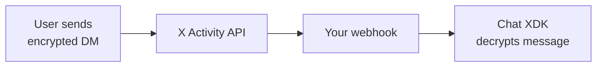

import { Button } from '/snippets/button.mdx';

The X Activity API delivers encrypted chat events (`chat.received` and `chat.sent`) to your application in real-time. Combined with webhooks, you can build responsive chat applications that react instantly to new messages.

## Overview

When a user sends or receives an encrypted DM, X can deliver the event to your webhook endpoint within milliseconds. The event payload contains the encrypted message, which you decrypt using the [Chat XDK](/xchat/xchat-xdk).



## Chat Event Types

| Event Name | Description | When it fires |
|:-----------|:------------|:--------------|
| `chat.received` | User receives an encrypted DM | When someone sends your subscribed user a message |
| `chat.sent` | User sends an encrypted DM | When your subscribed user sends a message |
| `chat.conversation_join` | User joins a group conversation | When your subscribed user is added to a group chat |

<Note>
Chat events are **private events** — they require OAuth 2.0 authentication from the user before you can subscribe to their events.
</Note>

---

## Quick Setup

### 1. Register a Webhook

First, register a webhook endpoint to receive events:

<CodeGroup>
```python Python
from xdk import Client

client = Client(bearer_token="YOUR_BEARER_TOKEN")

# Register your webhook URL
webhook = client.webhooks.create(
    url="https://your-app.com/webhook"
)
print(f"Webhook ID: {webhook.id}")
```

```typescript TypeScript
import { Client } from 'xdk';

const client = new Client({ bearerToken: 'YOUR_BEARER_TOKEN' });

// Register your webhook URL
const webhook = await client.webhooks.create({
  url: 'https://your-app.com/webhook'
});
console.log(`Webhook ID: ${webhook.id}`);
```
</CodeGroup>

### 2. Implement CRC Validation

X sends periodic Challenge-Response Check (CRC) requests to verify you control the webhook endpoint. Your server must respond with an HMAC-SHA256 hash.

<CodeGroup>
```python Python (Flask)
import hmac
import hashlib
import base64
from flask import Flask, request, jsonify

app = Flask(__name__)
CONSUMER_SECRET = "your_consumer_secret"

@app.route('/webhook', methods=['GET'])
def crc_check():
    crc_token = request.args.get('crc_token')
    
    # Create HMAC SHA-256 hash
    sha256_hash = hmac.new(
        CONSUMER_SECRET.encode('utf-8'),
        msg=crc_token.encode('utf-8'),
        digestmod=hashlib.sha256
    ).digest()
    
    response_token = base64.b64encode(sha256_hash).decode('utf-8')
    
    return jsonify({
        'response_token': f'sha256={response_token}'
    })
```

```typescript TypeScript (Express)
import express from 'express';
import crypto from 'crypto';

const app = express();
const CONSUMER_SECRET = 'your_consumer_secret';

app.get('/webhook', (req, res) => {
  const crcToken = req.query.crc_token as string;
  
  // Create HMAC SHA-256 hash
  const hash = crypto
    .createHmac('sha256', CONSUMER_SECRET)
    .update(crcToken)
    .digest('base64');
  
  res.json({
    response_token: `sha256=${hash}`
  });
});
```
</CodeGroup>

### 3. Subscribe to Chat Events

Create a subscription for the user's chat events:

<CodeGroup>
```python Python
# Subscribe to chat events for a user (one subscription per event type)
received_sub = client.activity.create_subscription(
    event_type="chat.received",
    filter={"user_id": "USER_ID_TO_MONITOR"}
)
print(f"Subscription ID: {received_sub.id}")

sent_sub = client.activity.create_subscription(
    event_type="chat.sent",
    filter={"user_id": "USER_ID_TO_MONITOR"}
)
print(f"Subscription ID: {sent_sub.id}")
```

```typescript TypeScript
// Subscribe to chat events for a user (one subscription per event type)
const receivedSub = await client.activity.createSubscription({
  eventType: 'chat.received',
  filter: { userId: 'USER_ID_TO_MONITOR' }
});
console.log(`Subscription ID: ${receivedSub.id}`);

const sentSub = await client.activity.createSubscription({
  eventType: 'chat.sent',
  filter: { userId: 'USER_ID_TO_MONITOR' }
});
console.log(`Subscription ID: ${sentSub.id}`);
```
</CodeGroup>

### 4. Handle Incoming Events

When a chat event arrives, decrypt it using the Chat XDK:

<CodeGroup>
```python Python (Flask)
from chat_xdk import Chat

# Initialize Chat XDK (unlocked at startup — see Getting Started)
chat = Chat(JUICEBOX_CONFIG)
chat.unlock("YOUR_PIN")

# Cache conversation keys in memory (use a database in production)
conversation_keys = {}

@app.route('/webhook', methods=['POST'])
def handle_event():
    event = request.json
    
    if event.get('event_type') in ['chat.received', 'chat.sent']:
        payload = event.get('payload', {})
        encrypted_event = payload.get('encrypted_event')
        conversation_id = payload.get('conversation_id')
        
        # Handle key changes first (new conversation or key rotation)
        if 'key_change' in payload:
            key_event = payload['key_change']['encrypted_event']
            conv_keys = chat.extract_conversation_keys([key_event])
            conversation_keys[conversation_id] = conv_keys
        
        # Get stored conversation keys for this conversation
        conv_keys = conversation_keys.get(conversation_id, {})
        
        # Decrypt the event using the Chat XDK
        event_obj = chat.decrypt_event(encrypted_event, conv_keys)
        
        if event_obj.get('type') == 'Message':
            content = event_obj.get('content', {})
            if content.get('content_type') == 'Text':
                print(f"New message: {content.get('text')}")
                print(f"From: {event_obj.get('sender_id')}")
                print(f"Verified: {event_obj.get('verified')}")
                
                # Process the message (e.g., respond, store, analyze)
                handle_incoming_message(event_obj, conversation_id)
    
    return '', 200
```

```typescript TypeScript (Express)
import { createChat } from 'chat-xdk';

// Initialize Chat XDK (unlocked at startup — see Getting Started)
const chat = await createChat({ juiceboxConfig, getAuthToken });
await chat.unlock('YOUR_PIN');

// Cache conversation keys in memory (use a database in production)
const conversationKeys = new Map<string, Record<string, Uint8Array>>();

app.post('/webhook', express.json(), async (req, res) => {
  const event = req.body;
  
  if (event.event_type === 'chat.received' || event.event_type === 'chat.sent') {
    const payload = event.payload || {};
    const encryptedEvent = payload.encrypted_event;
    const conversationId = payload.conversation_id;
    
    // Handle key changes first (new conversation or key rotation)
    if (payload.key_change) {
      const keyEvent = payload.key_change.encrypted_event;
      const convKeys = chat.extractConversationKeys([keyEvent]);
      conversationKeys.set(conversationId, convKeys);
    }
    
    // Get stored conversation keys for this conversation
    const convKeys = conversationKeys.get(conversationId) || {};
    
    // Decrypt the event using the Chat XDK
    const eventObj = chat.decryptEvent(encryptedEvent, convKeys);
    
    if (eventObj.type === 'Message') {
      const content = eventObj.content;
      if (content.contentType === 'Text') {
        console.log('New message:', content.text);
        console.log('From:', eventObj.senderId);
        console.log('Verified:', eventObj.verified);
        
        // Process the message
        await handleIncomingMessage(eventObj, conversationId);
      }
    }
  }
  
  res.sendStatus(200);
});
```
</CodeGroup>

---

## Event Payload Structure

Chat events are delivered as JSON. For **webhooks**, the structure is:

```json
{
  "event_type": "chat.received",
  "payload": {
    "conversation_id": "1234567890-0987654321",
    "sender_id": "1234567890",
    "encrypted_event": "base64_encoded_encrypted_event...",
    "key_change": {
      "encrypted_event": "base64_encoded_key_change_event..."
    }
  }
}
```

For the **activity stream** (`GET /2/activity/stream`), events are wrapped under a `data` envelope:

```json
{
  "data": {
    "event_type": "chat.received",
    "event_uuid": "abc123def456",
    "payload": {
      "conversation_id": "1234567890-0987654321",
      "sender_id": "1234567890",
      "encrypted_event": "base64_encoded_encrypted_event..."
    }
  }
}
```

| Field | Description |
|:------|:------------|
| `event_type` | `chat.received`, `chat.sent`, or `chat.conversation_join` |
| `payload.conversation_id` | The DM conversation identifier |
| `payload.sender_id` | User ID of the message sender |
| `payload.encrypted_event` | Base64-encoded encrypted message event (decrypt with Chat XDK) |
| `payload.key_change` | Present when the conversation key was rotated; contains the new key event |

---

## Webhook Requirements

| Requirement | Description |
|:------------|:------------|
| **HTTPS** | Webhook URL must use HTTPS |
| **Publicly accessible** | URL must be reachable from the internet |
| **No port in URL** | URLs like `https://example.com:5000/webhook` won't work |
| **Fast response** | Respond within 10 seconds |
| **200 OK** | Return 200 status to acknowledge receipt |
| **CRC support** | Respond to Challenge-Response Check requests |

---

## Signature Verification

Each webhook POST includes an `x-twitter-webhooks-signature` header. Verify this signature to confirm X is the source:

<CodeGroup>
```python Python
import hmac
import hashlib
import base64

def verify_signature(payload: bytes, signature: str, consumer_secret: str) -> bool:
    expected = 'sha256=' + base64.b64encode(
        hmac.new(
            consumer_secret.encode('utf-8'),
            msg=payload,
            digestmod=hashlib.sha256
        ).digest()
    ).decode('utf-8')
    
    return hmac.compare_digest(signature, expected)

# In your webhook handler:
@app.route('/webhook', methods=['POST'])
def handle_event():
    signature = request.headers.get('x-twitter-webhooks-signature', '')
    
    if not verify_signature(request.data, signature, CONSUMER_SECRET):
        return 'Invalid signature', 401
    
    # Process event...
```

```typescript TypeScript
import crypto from 'crypto';

function verifySignature(
  payload: Buffer,
  signature: string,
  consumerSecret: string
): boolean {
  const expected = 'sha256=' + crypto
    .createHmac('sha256', consumerSecret)
    .update(payload)
    .digest('base64');
  
  return crypto.timingSafeEqual(
    Buffer.from(signature),
    Buffer.from(expected)
  );
}

// In your webhook handler:
app.post('/webhook', express.raw({ type: '*/*' }), (req, res) => {
  const signature = req.headers['x-twitter-webhooks-signature'] as string;
  
  if (!verifySignature(req.body, signature, CONSUMER_SECRET)) {
    return res.status(401).send('Invalid signature');
  }
  
  // Process event...
});
```
</CodeGroup>

---

## Subscription Limits

| Package Tier | Maximum Subscriptions |
|:-------------|:---------------------|
| Self-serve | 1,000 |
| Enterprise | 50,000 |
| Partner | 100,000 |

---

## Best Practices

<CardGroup cols={2}>
  <Card title="Respond quickly" icon="bolt">
    Return 200 OK as soon as you receive the event. Process messages asynchronously.
  </Card>
  <Card title="Handle duplicates" icon="copy">
    Use `message_id` to deduplicate events. X may retry delivery.
  </Card>
  <Card title="Secure key storage" icon="key">
    Use [Juicebox](/xchat/cryptography-primer#juicebox-distributed-key-storage) for secure conversation key storage.
  </Card>
  <Card title="Monitor health" icon="heart-pulse">
    Log and monitor CRC checks. Failed CRCs will disable your webhook.
  </Card>
</CardGroup>

---

## API Reference

### Activity Subscriptions

Manage which chat events you receive:

| Method | Endpoint | Description |
|:-------|:---------|:------------|
| POST | [`/2/activity/subscriptions`](/x-api/activity/create-x-activity-subscription) | Subscribe to `chat.received` / `chat.sent` events |
| GET | [`/2/activity/subscriptions`](/x-api/activity/get-x-activity-subscriptions) | List your active subscriptions |
| PUT | [`/2/activity/subscriptions/{subscription_id}`](/x-api/activity/update-x-activity-subscription) | Update subscription filters |
| DELETE | [`/2/activity/subscriptions/{subscription_id}`](/x-api/activity/deletes-x-activity-subscription) | Remove a subscription |

### Activity Stream

Connect to receive events in real-time:

| Method | Endpoint | Description |
|:-------|:---------|:------------|
| GET | [`/2/activity/stream`](/x-api/activity/activity-stream) | Persistent HTTP stream for subscribed events |

### Webhook Management

Register and manage webhook endpoints:

| Method | Endpoint | Description |
|:-------|:---------|:------------|
| POST | [`/2/webhooks`](/x-api/webhooks/create-webhook) | Register a new webhook URL |
| GET | [`/2/webhooks`](/x-api/webhooks/get-webhook) | List your registered webhooks |
| PUT | [`/2/webhooks/:webhook_id`](/x-api/webhooks/validate-webhook) | Trigger CRC check / re-enable webhook |
| DELETE | [`/2/webhooks/:webhook_id`](/x-api/webhooks/delete-webhook) | Delete a webhook |

---

## Related Resources

<CardGroup cols={2}>
  <Card title="X Activity API" icon="bell" href="/x-api/activity/introduction">
    Full Activity API documentation with all event types
  </Card>
  <Card title="Webhooks API" icon="webhook" href="/x-api/webhooks/introduction">
    Webhook management endpoints and security details
  </Card>
  <Card title="Chat XDK Reference" icon="code" href="/xchat/xchat-xdk">
    Complete encryption/decryption API reference
  </Card>
  <Card title="Getting Started" icon="rocket" href="/xchat/getting-started">
    End-to-end tutorial for building encrypted chat
  </Card>
</CardGroup>
